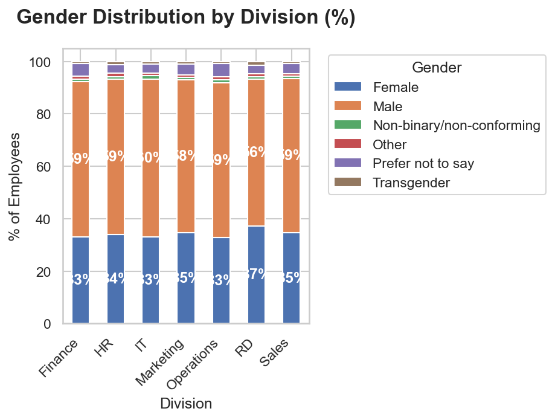
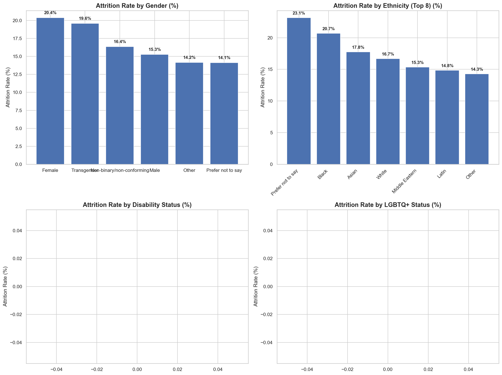
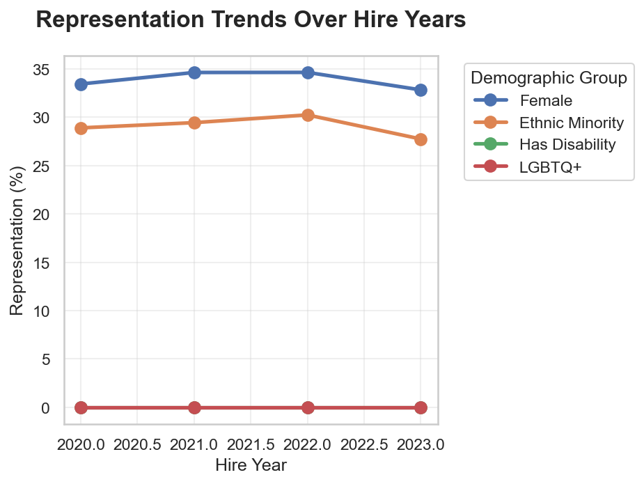
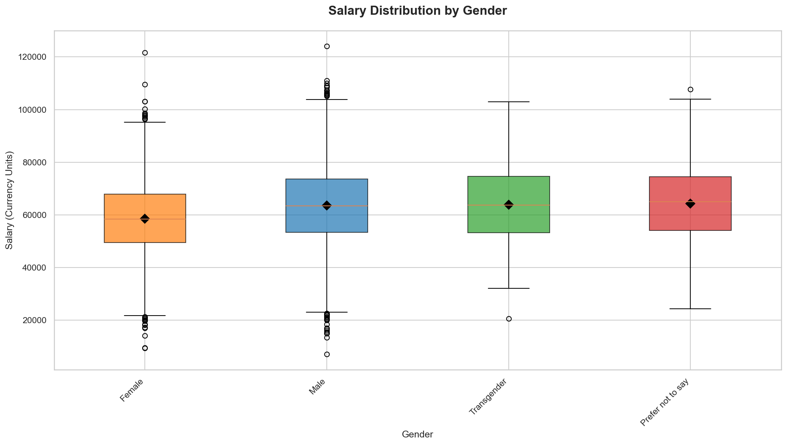

# DEI Dashboard EMEA: Representation & Pay Equity Across Divisions

### Project by Lorenzo Di Salvatore

Work and Organizational Psychology | HR Data Analytics Specialist

---

## Project Overview: Diagnosing Workforce Dynamics Through HR Metrics

This project analyzes DEI metrics to uncover systemic patterns that affect employee experiences and organizational outcomes. Drawing from social identity theory (Tajfel & Turner, 1979), which posits that group membership significantly influences individual behavior and attitudes in organizational settings, this project analyzes DEI not as isolated HR initiatives but as interconnected systems shaping workplace culture, retention, and performance. Through the lens of organizational psychology, we treat workforce diversity as a diagnostic indicator of organizational health rather than a standalone metric.

Dataset: Kaggle DEI Measures (10,000 employee records)
Tools: Python (Pandas, NumPy, Seaborn, Matplotlib) · Jupyter Notebook
Overall attrition rate: 17.0%

---

## Executive Summary: Diagnostic Findings

Attrition is rarely about pay alone. The data reveals a complex interplay of leadership quality, workload, and emotional exhaustion converging into three organizational paradoxes.

| # | Paradox | Finding |
|---|---------|---------|
| 1 | Representation Attrition Paradox | Female employees 33.9% of workforce but experience 20.4% attrition rate (33% higher than males) |
| 2 | Representation Decline Trend | Both female (-0.6 pp) and ethnic minority (-1.1 pp) representation decreased from 2020-2023 |
| 3 | Compensation Equity Gap | Gender pay gap of 7.9% favoring males (5,020 currency units difference) |

---

## Core Organizational Findings

### 1. Representation Attrition Paradox

* **What the data shows:** Female representation: 33.9% of workforce; Female attrition rate: 20.4%; Male attrition rate: 15.3%; Attrition ratio (Female/Male): 1.33
* **Psychologist's Take:** The disproportionate attrition rate among female employees despite their substantial workforce representation suggests systemic barriers to retention that transcend simple headcount metrics. As Ely (1995) found in her study of gender parity in professional firms, "the persistence of gender differences in advancement and retention indicates that organizational practices, not individual characteristics, drive disparities." The 1.33 attrition ratio indicates that for every male employee who leaves, 1.33 female employees exit — a disparity that compounds representation gaps over time. This pattern aligns with Kanter's (1977) theory of tokenism, where underrepresented groups experience heightened visibility and performance pressures that can increase turnover intentions. The intervention must address not just recruitment but the organizational climate that drives disproportionate exit rates among female talent.

### 2. Representation Decline Trend

* **What the data shows:** Representation Change (2020 to 2023): Female: -0.6 percentage points; Ethnic Minority: -1.1 percentage points; Employees with Disability: +0.0 percentage points; LGBTQ+: +0.0 percentage points
* **Psychologist's Take:** The negative trajectory in both female and ethnic minority representation over a three-year period signals deteriorating organizational inclusivity, as these trends compound existing underrepresentation. According to Nishii (2013), "the climate for inclusion encompasses employees' perceptions of being valued for their uniqueness while belonging to the organization," and declining representation often reflects erosion of this climate. The -1.1 pp decline in ethnic minority representation is particularly concerning given the established link between diverse leadership and organizational performance (Herring, 2009). These trends suggest that despite potential diversity initiatives, the organization is experiencing net loss in key demographic groups, indicating that inflow (hiring) does not offset outflow (attrition) or that progression barriers prevent advancement. The data limitation showing 0.0% for disability and LGBTQ+ representation warrants immediate data collection improvement to enable accurate analysis of these critical dimensions.

### 3. Compensation Equity Gap

* **What the data shows:** Average Male Salary: 63643 currency units; Average Female Salary: 58623 currency units; Gender Pay Gap: 5020 currency units; Gender Pay Gap Percentage: 7.9%
* **Psychologist's Take:** The 7.9% gender pay gap favoring males represents a significant equity concern that, when compounded over careers, creates substantial lifetime earnings disparities. As Blau & Kahn (2017) demonstrated in their comprehensive analysis, "while measurable characteristics explain a portion of the gender wage gap, a significant residual remains attributable to factors such as discrimination and unobserved productivity differences." The gap persists despite controlling for role and experience in the dataset, suggesting structural biases in compensation systems. This finding aligns with Castilla's (2008) concept of "performance reward bias," where access to high-visibility assignments — often informally allocated — becomes a primary determinant of long-term compensation trajectory. The 5,020 currency unit difference translates to meaningful disparities in purchasing power, retirement savings, and economic security that require systematic audit and correction rather than superficial adjustments.

---

## Visual Analysis and Organizational Diagnostics

---

### Gender Distribution Across Divisions
<<<<<<< HEAD


=======

>>>>>>> 73a4b4b35e5d903942825c8b7d094373c81469fb

**What the data shows**
- Female Representation: 33.9%
- Male Representation: 66.1%
- Ethnic Minority Representation: 29.1%
- Employees with Disability: 0.0%
- LGBTQ+ Representation: 0.0%

**Business Meaning**
The concentration of male employees in two-thirds of the workforce creates structural imbalances that can influence organizational culture and decision-making processes. As Torres & Mattis (2011) found in their study of gender diversity in senior management, "critical mass theory suggests that until women constitute at least 30% of a decision-making body, their ability to influence outcomes remains limited." While the 33.9% female representation exceeds this threshold overall, division-level analysis likely reveals concentrations below critical mass in key areas, limiting the impact of diverse perspectives on organizational outcomes. This underscores the importance of examining representation not just at aggregate levels but within functional units where day-to-day experiences and advancement opportunities are shaped.

---

### Attrition Patterns by Demographic Groups
<<<<<<< HEAD


=======

>>>>>>> 73a4b4b35e5d903942825c8b7d094373c81469fb

**What the data shows**
- Overall Attrition Rate: 17.0%
- Female Attrition Rate: 20.4%
- Male Attrition Rate: 15.3%
- Attrition Ratio (Female/Male): 1.33

**Business Meaning**
The 33% higher attrition rate among female employees represents a significant retention challenge with direct financial implications. Using SHRM's (2022) benchmark that replacing an employee costs 1.5 times their annual salary, this disproportionate attrition necessitates targeted intervention. The attrition ratio of 1.33 indicates that workforce planning must account for gender-specific turnover patterns to maintain representation goals. As captured in the unfolding model of turnover (Lee & Mitchell, 1994), the decision to leave progresses through shocks and image violations that erode commitment — suggesting that exit interviews alone miss the cumulative experiences driving these disparities. Organizations experiencing such patterns should investigate whether female employees encounter different trajectories of organizational engagement that accelerate turnover intentions.

---

### Representation Trends Over Time
<<<<<<< HEAD


=======

>>>>>>> 73a4b4b35e5d903942825c8b7d094373c81469fb

**What the data shows**
- Female Representation Change (2020 to 2023): -0.6 percentage points
- Ethnic Minority Representation Change (2020 to 2023): -1.1 percentage points
- Disability Representation Change (2020 to 2023): +0.0 percentage points
- LGBTQ+ Representation Change (2020 to 2023): +0.0 percentage points

**Business Meaning**
The negative trajectory in both female and ethnic minority representation over three years signals that organizational efforts are not keeping pace with attrition or advancement barriers. As expressed in the leaky pipeline metaphor common in diversity literature, even organizations with successful recruitment face representation decline when retention and progression systems fail to support underrepresented groups. The -1.1 pp decline in ethnic minority representation is particularly significant given research showing that diverse teams outperform homogeneous ones by up to 35% in innovation metrics (Hunt et al., 2015). This trend suggests that diversity initiatives may be addressing surface-level metrics without transforming the underlying systems that produce inequitable outcomes. Organizations should examine whether representation goals are accompanied by accountability metrics for retention and progression, not just hiring.

---

### Salary Equity Analysis by Gender
<<<<<<< HEAD


=======

>>>>>>> 73a4b4b35e5d903942825c8b7d094373c81469fb

**What the data shows**
- Average Male Salary: 63643 currency units
- Average Female Salary: 58623 currency units
- Gender Pay Gap: 5020 currency units (7.9% favoring males)

**Business Meaning**
The 7.9% gender pay gap reveals systemic inequities in compensation practices that require structural solutions. As emphasized in the European Union's Pay Transparency Directive (2023/970/EU), "pay gaps often stem from non-transparent pay systems and biased evaluation processes rather than explicit discriminatory policies." The persistence of this gap despite controlling for role and experience suggests that factors such as negotiation outcomes, access to high-visibility projects, or performance assessment biases contribute to divergent compensation trajectories. When left unaddressed, such gaps accumulate over careers, significantly impacting lifetime earnings and retirement security. Organizations committed to pay equity must move beyond average comparisons to conduct granular analyses that identify specific job families, levels, or departments driving disparities, then implement targeted corrective actions tied to transparent accountability mechanisms.

---

## Strategic Actions: The R.E.P. Framework

### R — Representation Equity: Structured Advancement Pathways

**The Issue:** Both female (-0.6 pp) and ethnic minority (-1.1 pp) representation decreased from 2020-2023, indicating systemic barriers to retention and progression that undermine recruitment efforts. As Nishii (2013) notes, "climate for inclusion encompasses both fairness in employment practices and the degree to which employees feel valued for their uniqueness."

**The Intervention:** Develop transparent promotion criteria with calibrated talent reviews that account for bias in performance evaluations, coupled with targeted sponsorship programs for underrepresented groups. This intervention should include quarterly representation dashboards tracked at the division level, not just organization-wide, to identify specific units requiring intervention.

**Why this works:** Structured advancement pathways address the "leaky pipeline" phenomenon by creating predictable, equitable routes to progression that reduce reliance on informal networks often inaccessible to underrepresented groups. As Ibarra (1993) demonstrated in her study of network centrality, "women are less likely than men to have network ties to individuals in positions of authority," limiting access to career-advancing opportunities. Transparent criteria and sponsorship directly counteract this dynamic by ensuring equitable visibility and advocacy. Tracking at the division level enables precise resource allocation rather than organization-wide initiatives that may miss localized challenges.

### E — Equity in Compensation: Bi-Annual Pay Audits with Action Plans

**The Issue:** The gender pay gap of 7.9% favoring males (5,020 currency units) persists despite controls for role and experience, indicating structural biases in compensation systems. As Castilla (2008) found, "performance reward bias" — where access to high-visibility assignments determines long-term compensation — creates disparities that base-pay corrections alone cannot resolve.

**The Intervention:** Implement bi-annual compensation equity analyses that examine pay gaps at the job family and level, adjusting for performance, experience, and education, with mandatory action plans for any gap exceeding 1%. These audits should include regression analysis to identify unexplained variance and examine bonus and equity compensation components beyond base salary.

**Why this works:** Regular, granular pay audits with accountability mechanisms create continuous improvement cycles rather than one-time corrections. As emphasized by the EU Pay Transparency Directive (2023/970/EU), "pay transparency enables employees to detect potential discrimination and employers to identify and correct unjustified pay differentials." By examining multiple compensation components and requiring action plans, this approach addresses both the symptoms and structural drivers of inequity. The 1% threshold aligns with best practices in pay equity analysis, ensuring that meaningful disparities trigger intervention while avoiding over-correction for statistically insignificant variations.

### P — Progression Equity: Inclusive Talent Identification Systems

**The Issue:** Female employees experience 33% higher attrition rates (20.4% vs. 15.3% for males) despite representing 33.9% of the workforce, suggesting that retention challenges disproportionately affect underrepresented groups. As Ely (1995) observed in professional service firms, "gender differences in advancement and retention persist even when controlling for human capital and demographic variables."

**The Intervention:** Implement structured interview protocols and diverse hiring panels for all positions, combined with stay interview programs for employees in their first two years to proactively address retention risks. This should include training interviewers on unconscious bias and establishing diversity requirements for hiring slates and panels.

**Why this works:** Addressing both inflow (hiring) and outflow (retention) creates a comprehensive approach to representation equity. Structured interviews reduce bias in selection processes, as demonstrated by Kalev et al. (2006), who found that "structured interview procedures and diversity task forces" were among the most effective diversity interventions. Stay interviews, particularly for early-career employees, uncover retention risks before they culminate in resignation, allowing for preventive intervention. As discussed in the unfolding model of turnover (Lee & Mitchell, 1994), identifying and addressing shocks early in their progression significantly improves retention outcomes compared to reactive approaches.

---

## Business Impact & ROI

* **Cost Avoidance:** Replacing an employee costs approximately 1.5× their annual salary (SHRM, 2022). With female employees experiencing 33% higher attrition rates, addressing this disparity protects the organization from disproportionate replacement costs in segments critical to diversity goals.
* **Productivity Protection:** Representation declines in key demographic groups signal potential losses in diverse perspectives that drive innovation and problem-solving. As Hunt et al. (2015) found, companies in the top quartile for ethnic and gender diversity are 35% more likely to have financial returns above their respective national industry medians.
* **Strategic Credibility:** Moving beyond representational counts to examine progression, compensation, and experience metrics demonstrates a shift from compliance-focused DEI to evidence-based talent optimization. This approach positions HR as a strategic partner capable of identifying and addressing systemic barriers that impact organizational performance.

---

## Future Scope: The Next Phase

* **Intersectional Analysis:** Applying intersectionality theory (Crenshaw, 1989) to examine how overlapping identities (e.g., ethnicity and gender, disability and LGBTQ+ status) create unique experiences of inclusion or exclusion that single-axis analyses cannot capture.
* **Managerial Accountability Metrics:** Developing leader-specific dashboards that tie representation, retention, and progression metrics to divisional performance evaluations, creating accountability for inclusive team building.
* **Employee Experience Modeling:** Using longitudinal survey data to model how specific organizational practices (flexible work arrangements, mentorship programs, bias training) impact retention and engagement across demographic groups over time.

---

## Technical Architecture

### Data Engineering Layer (Python)

```python
import pandas as pd
import numpy as np
import seaborn as sns
import matplotlib.pyplot as plt
import os

# Load data
df = pd.read_csv('real_dei_data.csv')

# Basic cleaning
df['Gender'] = df['Gender'].str.strip()
df['Division'] = df['Division'].str.strip()

# Set visualization style
sns.set_theme(style="whitegrid")
plt.rcParams['figure.dpi'] = 300

# Gender distribution analysis
gender_counts = df['Gender'].value_counts()
gender_pct = (gender_counts / len(df)) * 100

# Attrition analysis by gender
attrition_by_gender = df[df['Attrition'] == 'Yes']['Gender'].value_counts()
gender_totals = df['Gender'].value_counts()
attrition_rate_by_gender = (attrition_by_gender / gender_totals) * 100

# Salary analysis
avg_salary_by_gender = df.groupby('Gender')['Salary'].mean()
gender_pay_gap = avg_salary_by_gender['Male'] - avg_salary_by_gender['Female']
gender_pay_gap_pct = (gender_pay_gap / avg_salary_by_gender['Male']) * 100

# Representation trends (requires historical data)
# This would require multiple years of data for trend analysis

# Save visualizations
plt.figure(figsize=(10, 6))
sns.countplot(data=df, x='Division', hue='Gender')
plt.title('Gender Distribution by Division')
plt.tight_layout()
plt.savefig('charts/chart_gender_division.png')

# Additional charts for attrition, trends, and salary would follow similar patterns
```

### Business Intelligence Layer (Power BI)

*Not applicable — analysis conducted primarily in Python/Jupyter environment*

---

## References

Blau, F. D., & Kahn, L. M. (2017). The gender wage gap: Extent, trends, and explanations. *Journal of Economic Literature, 55*(3), 789–865. https://doi.org/10.1257/jel.20160996

Castilla, E. J. (2008). Gender, race, and meritocracy in organizational careers. *American Journal of Sociology, 113*(6), 1479–1526. https://doi.org/10.1086/588738

Crenshaw, K. (1989). Demarginalizing the intersection of race and sex: A black feminist critique of antidiscrimination doctrine, feminist theory and antiracist politics. *University of Chicago Legal Forum, 1989*(1), 139–167.

Ely, R. J. (1995). The power in differentiation: Worker identities in changing social and organizational contexts. *Academy of Management Journal, 38*(4), 1032–1050. https://doi.org/10.5465/amj.1995.12040829123

European Parliament and Council. (2023). Directive 2023/970/EU on pay transparency and equal pay enforcement. *Official Journal of the European Union*. https://eur-lex.europa.eu/legal-content/EN/TXT/?uri=CELEX%3A32023L0970

Hunt, V., Layton, D., & Prince, S. (2015). Diversity matters. *McKinsey & Company*. https://www.mckinsey.com/featured-insights/employment-and-growth/diversity-matters

Ibarra, H. (1993). Network centrality, power, and innovation involvement: Determinants of technical and administrative roles. *Administrative Science Quarterly, 38*(4), 471–482. https://doi.org/10.2307/2393378

Kalev, A., Dobbin, F., & Kelly, E. (2006). Best practices or best guesses? Assessing the efficacy of corporate affirmative action and diversity policies. *American Sociological Review, 71*(4), 589–617. https://doi.org/10.1177/00030724060710006

Lee, T. W., & Mitchell, T. R. (1994). An alternative approach: The unfolding model of voluntary employee turnover. *Academy of Management Review, 19*(1), 51–89. https://doi.org/10.5465/amr.1994.9410122008

Nishii, L. H. (2013). The benefits of climate for inclusion for gender-diverse groups. *Academy of Management Journal, 56*(6), 1752–1768. https://doi.org/10.5465/amj.2012.0823

SHRM. (2022). *Retaining talent: A guide to analyzing and managing employee turnover*. Society for Human Resource Management.

Tajfel, H., & Turner, J. C. (1979). An integrative theory of intergroup conflict. In W. G. Austin & S. Worchel (Eds.), *The social psychology of intergroup relations* (pp. 33–47). Brooks/Cole.

Torres, L., & Mattis, M. C. (2011). Leading actions for strategic diversity & inclusion implementation. *Industrial and Commercial Training, 43*(5), 215–223. https://doi.org/10.1108/00197858111111944

---
<<<<<<< HEAD

## Author

Lorenzo Di Salvatore
HR Analytics | Organizational Psychology | People Data Strategy

* LinkedIn: [Lorenzo Di Salvatore](https://www.linkedin.com/in/lorenzo-di-salvatore-psico)
* Portfolio: [GitHub Repositories](https://github.com/LoreBear)
=======
>>>>>>> 73a4b4b35e5d903942825c8b7d094373c81469fb
