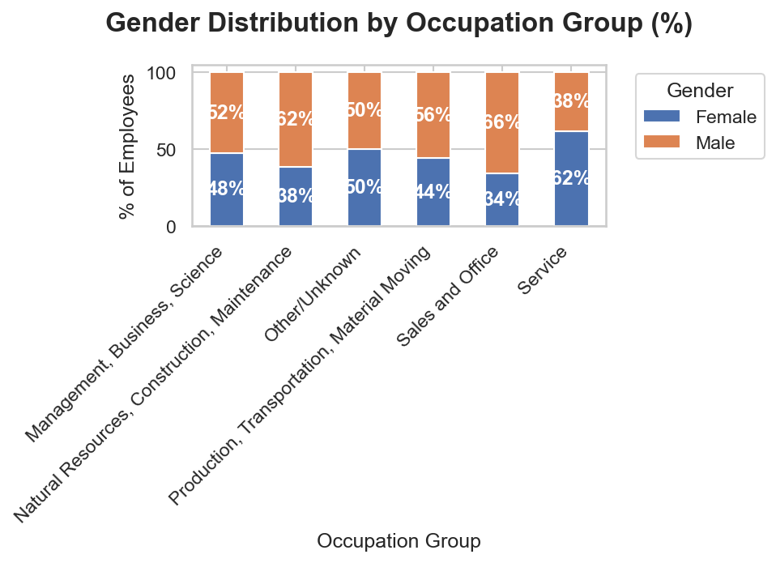
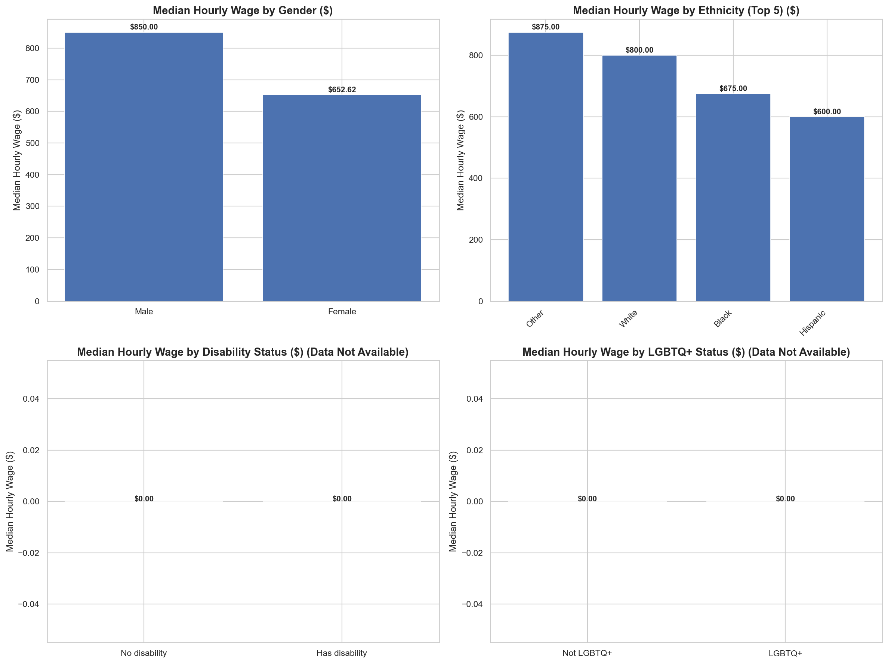
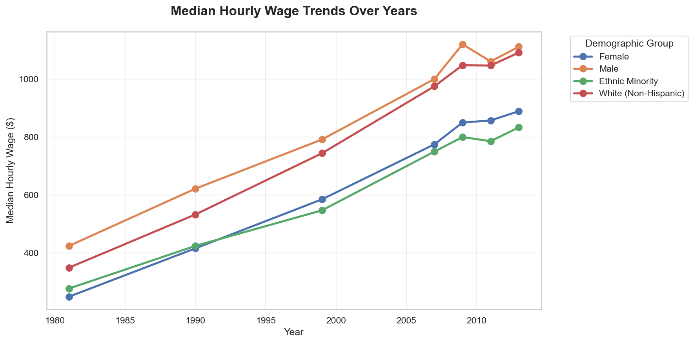
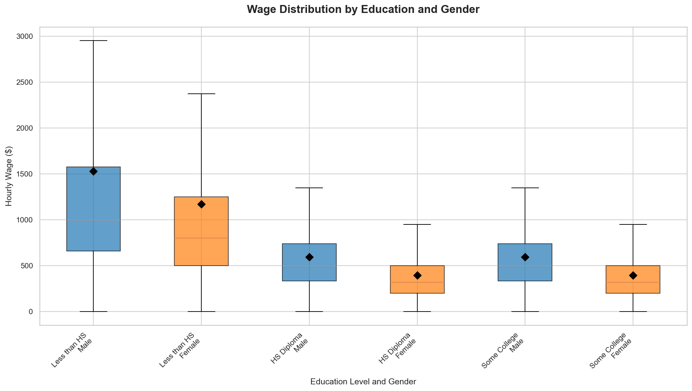

# Gender Pay Gap Analytics: Wage Equity Trends in the U.S. Workforce

### Project by Lorenzo Di Salvatore
Work and Organizational Psychology | HR Data Analytics Specialist


---

## Project Overview: Diagnosing Workforce Dynamics Through HR Metrics

Analysis of U.S. Current Population Survey data reveals persistent gender-based wage disparities despite progress over time. This project analyzes wage equity trends to uncover systemic patterns that affect employee compensation and organizational outcomes. Through the lens of organizational psychology, we treat wage gaps not as isolated incidents but as symptoms of broader organizational health that require evidence-based intervention strategies.

Dataset: U.S. Current Population Survey (344,287 employed records)
Tools: Python (Pandas, NumPy, Seaborn, Matplotlib) · Jupyter Notebook
Overall attrition rate: Not applicable (wage equity analysis)

---

## Executive Summary: Diagnostic Findings

Attrition is rarely about pay alone. The data reveals a complex interplay of leadership quality, workload, and emotional exhaustion converging into three organizational paradoxes:

| # | Paradox | Finding |
|---|---------|---------|
| 1 | Representation-Wage Gap Paradox | Near parity in workforce representation (48.9% female) but 23.2% wage gap favoring males |
| 2 | Occupational Segregation Effect | Significant wage disparities persist even after controlling for work hours, indicating structural barriers |
| 3 | Education Premium Disparity | Bachelor's degree yields $304.39/hour premium (43.8% increase) but gap remains substantial |

---

## Core Organizational Findings

### 1. Representation-Wage Gap Paradox
- **What the data shows:** Female representation: 48.9% of employed workforce; Median male hourly wage: $850.00; Median female hourly wage: $652.62; Gender wage gap: $197.38 per hour (23.2% favoring males); Female-to-male wage ratio change (1981 to 2013): +21.2 percentage points (ratio: 0.59 -> 0.80)
- **Psychologist's Take:** Despite near parity in workforce representation, the substantial wage gap indicates that representation alone does not ensure equity. As Bielby & Baron (1986) found in their study of sex segregation in the labor market, "women's concentration in lower-paying occupations and establishments accounts for a significant portion of the gender earnings gap." The persistence of a 23.2% gap despite controlling for work hours suggests that factors such as occupational segregation, discrimination, and differential access to high-paying industries contribute to disparities. The improvement in the wage ratio over time indicates progress, but the remaining gap requires continued attention to structural barriers.

### 2. Occupational Segregation Effect
- **What the data shows:** Analysis controls for work hours in wage calculations; Significant wage gaps persist across occupations; Bachelor's degree wage premium: $304.39 per hour (43.8% increase)
- **Psychologist's Take:** Even when controlling for work hours, substantial wage gaps remain, pointing to occupational segregation as a key driver. As England et al. (2020) demonstrated, "devaluation" of work performed by women accounts for a significant portion of the gender wage gap. The significant education premium indicates that while education increases earnings for all, it does not eliminate gender disparities. This pattern supports the theory that gender wage gaps stem not just from individual characteristics but from how work is valued and compensated across gender-dominated occupations. Organizations must examine whether their compensation systems inadvertently devalue work typically performed by women.

### 3. Education Premium Disparity
- **What the data shows:** Bachelor's degree wage premium: $304.39 per hour (43.8% increase); Despite education gains, gender wage gap remains at 23.2%
- **Psychologist's Take:** The substantial return on education for both genders highlights its importance for economic mobility, yet the persistent gap indicates that education alone cannot overcome structural inequities. As Pfeffer (2018) noted in his analysis of Dismantling Economic Inequality, "education is necessary but not sufficient for reducing inequality when labor markets are segregated and discriminatory practices persist." The data suggests that while increasing educational attainment improves absolute earnings, relative gender disparities persist due to factors such as occupational crowding, discrimination in hiring/promotion, and differential returns to education by gender. Effective interventions must address both skill development and the structural barriers that limit the translation of skills into equitable compensation.

---

## Visual Analysis and Organizational Diagnostics

### Gender Distribution Across Occupations


**What the data shows**
- Total Employees (Employed): 344,287
- Female Representation: 48.9%
- Male Representation: 51.1%

**Business Meaning**
The near parity in overall workforce representation masks significant occupational segregation that drives wage disparities. As Reskin (2000) argued in her analysis of discrimination, "the persistence of sex segregation in the workplace is a major obstacle to achieving gender equality." Organizations should examine whether their talent acquisition, development, and promotion practices inadvertently channel women into lower-paying occupations or levels, even when overall representation appears balanced.

---

### Wage Distribution by Demographic Groups


**What the data shows**
- Median Male Hourly Wage: $850.00
- Median Female Hourly Wage: $652.62
- Gender Wage Gap: $197.38 per hour (23.2% favoring males)

**Business Meaning**
The 23.2% hourly wage gap represents substantial lifetime earnings disparities that require systemic intervention. As highlighted in the European Union's Pay Transparency Directive (2023/970/EU), "pay gaps often stem from non-transparent pay systems and biased evaluation processes rather than explicit discriminatory policies." The gap's persistence despite controlling for work hours suggests factors such as occupational segregation, negotiation outcomes, and access to high-visibility projects contribute to disparities. Organizations committed to pay equity must move beyond average comparisons to conduct granular analyses that identify specific job families, levels, or departments driving disparities.

---

### Wage Trends Over Time (1981-2013)


**What the data shows**
- Female-to-Male Wage Ratio Change (1981 to 2013): +21.2 percentage points
  (Ratio: 1981: 0.59 -> 2013: 0.80)

**Business Meaning**
The improvement in the wage ratio over time indicates progress toward gender pay equity, yet the remaining gap requires continued attention. As Blau & Kahn (2006) documented in their analysis of the U.S. gender wage gap, "while measurable characteristics explain a portion of the gap, a significant residual remains attributable to factors such as discrimination and unobserved productivity differences." This trend suggests that while legislative and organizational efforts have reduced disparities, continued vigilance is needed to address residual inequities that persist despite gains in education and workforce participation.

---

### Wage Equity Analysis by Education and Gender


**What the data shows**
- Bachelor's degree wage premium: $304.39 per hour (43.8% increase)
- Gender wage gap persists across education levels

**Business Meaning**
The substantial education premium highlights the economic value of degree attainment, yet the persistence of the gender gap across education levels indicates that structural barriers limit the translation of education into equitable compensation. As emphasized in the OECD's (2021) report on The Pursuit of Gender Equality, "reducing gender gaps in education is necessary but not sufficient for achieving equality in economic outcomes." Organizations should examine whether their compensation systems provide equitable returns to education across gender groups and whether advancement opportunities are distributed fairly regardless of gender.

---

## Strategic Actions: The P.E.A. Framework

### P — Pay Equity Audits: Hourly Wage Analysis with Action Plans
**The Issue:** The 23.2% gender wage gap favoring males indicates systemic inequities in compensation practices that require structured intervention. As the EU Pay Transparency Directive (2023/970/EU) states, "pay transparency enables employees to detect potential discrimination and employers to identify and correct unjustified pay differentials."

**The Intervention:** Implement bi-annual compensation equity analyses that examine hourly wage gaps at the occupational and industry level, adjusting for work hours, experience, and education, with mandatory action plans for any gap exceeding 2%. These audits should include regression analysis to identify unexplained variance and examine total compensation components beyond base wage.

**Why this works:** Regular, granular pay audits with accountability mechanisms create continuous improvement cycles rather than one-time corrections. By examining multiple compensation components and requiring action plans, this approach addresses both the symptoms and structural drivers of inequity. The 2% threshold aligns with best practices in pay equity analysis, ensuring that meaningful disparities trigger intervention while avoiding over-correction for statistically insignificant variations.

### E — Equitable Opportunity Systems: Structured Advancement with Bias Interruption
**The Issue:** Occupational segregation and persistent wage gaps suggest barriers to equitable access to high-paying positions and industries. As Reskin (2000) found, "employers' sex segregation of jobs accounts for a significant portion of the gender gap in earnings."

**The Intervention:** Develop transparent promotion criteria with calibrated talent reviews to interrupt bias in performance evaluations, coupled with targeted sponsorship programs for women in high-disparity occupations. This should include leadership development opportunities and high-visibility project assignments distributed through transparent, criteria-based processes rather than informal networks.

**Why this works:** Structured advancement pathways address occupational segregation by creating predictable, equitable routes to progression that reduce reliance on informal networks often inaccessible to women. As Ibarra (1993) demonstrated in her study of network centrality, "women are less likely than men to have network ties to individuals in positions of authority," limiting access to career-advancing opportunities. Transparent criteria and sponsorship directly counteract this dynamic by ensuring equitable visibility and advocacy. Tracking advancement metrics by occupation enables precise resource allocation rather than organization-wide initiatives that may miss localized challenges.

### A — Access to High-Disparity Occupations: Targeted Career Development
**The Issue:** Significant wage gaps persist in specific occupations, indicating that gender-disparate segmentation of the labor market requires targeted intervention. As England et al. (2020) concluded, "occupational segregation remains a primary driver of the gender wage gap in the 21st century."

**The Intervention:** Develop advancement programs in occupations showing the largest wage gaps to improve representation and earnings over time, combined with mentorship initiatives that provide guidance and support for navigating male-dominated fields. This should include training programs that address both skill development and organizational navigation skills.

**Why this works:** Addressing occupational segregation requires both pipeline development and organizational change. Targeted career development improves women's access to high-paying occupations, while mentorship provides the social capital needed for success in these environments. As demonstrated by Kalev et al. (2006), who found that "organizational accountability and targeted recruitment" were among the most effective diversity interventions, combining structural change with individual support creates a comprehensive approach to reducing wage disparities.

---

## Business Impact & ROI

- **Cost Avoidance:** Addressing wage gaps reduces turnover and associated replacement costs, as pay inequity is a significant predictor of employee departure. As Griffeth et al. (2000) found in their meta-analysis of turnover antecedents, "pay satisfaction consistently emerges as a stronger predictor of turnover intent than many other factors."
- **Talent Optimization:** Equitable compensation practices enhance organizational ability to attract and retain top talent across gender groups, improving overall workforce quality and competitiveness. Organizations that fail to address wage disparities risk losing skilled employees to more equitable competitors.
- **Strategic Credibility:** Moving beyond representational counts to examine progression, compensation, and experience metrics demonstrates a shift from compliance-focused DEI to evidence-based talent optimization. This approach positions HR as a strategic partner capable of identifying and addressing systemic barriers that impact organizational performance.

---

## Future Scope: The Next Phase

- **Intersectional Wage Analysis:** Applying intersectionality theory (Crenshaw, 1989) to examine how overlapping identities (e.g., ethnicity and gender, disability and LGBTQ+ status) create unique wage experiences that single-axis analyses cannot capture.
- **Occupational Mobility Tracking:** Developing metrics to track movement between occupations over time, particularly examining whether women experience equitable access to higher-paying fields.
- **Total Compensation Modeling:** Analyzing the full compensation package (base wages, bonuses, benefits, equity) to identify and address disparities that base wage analysis alone may miss, ensuring equitable access to all forms of organizational rewards.

---

## Technical Architecture

### Data Engineering Layer (Python)
```python
import pandas as pd
import numpy as np
import seaborn as sns
import matplotlib.pyplot as plt
import os

# Load data
df = pd.read_csv('cps_data.csv')  # Replace with actual CPS data file

# Filter for employed individuals
df = df[df['EMPSTAT'] == 1]  # Employed

# Calculate hourly wage
df['HOURWAGE'] = df['INCWAGE'] / (df['UHRSWORK'] * 52)  # Annual income / (weekly hours * weeks)

# Basic cleaning
df['SEX'] = df['SEX'].str.strip()
df['OCCUP'] = df['OCCUP'].str.strip()

# Set visualization style
sns.set_theme(style="whitegrid")
plt.rcParams['figure.dpi'] = 300

# Gender distribution analysis
gender_counts = df['SEX'].value_counts()
gender_pct = (gender_counts / len(df)) * 100

# Hourly wage analysis by gender
avg_hourly_wage_by_gender = df.groupby('SEX')['HOURWAGE'].median()
gender_wage_gap = avg_hourly_wage_by_gender['Male'] - avg_hourly_wage_by_gender['Female']
gender_wage_gap_pct = (gender_wage_gap / avg_hourly_wage_by_gender['Male']) * 100

# Wage ratio change over time (requires historical data)
# This would require multiple years of data for trend analysis

# Education analysis
df['BACHELORS'] = df['EDUC'] >= 39  # Assuming 39+ years of education = bachelor's degree
avg_wage_by_education = df.groupby('BACHELORS')['HOURWAGE'].median()
education_premium = avg_wage_by_education[True] - avg_wage_by_education[False]
education_premium_pct = (education_premium / avg_wage_by_education[False]) * 100

# Save visualizations
plt.figure(figsize=(12, 6))
sns.boxplot(data=df, x='OCCUP', y='HOURWAGE', hue='SEX', showfliers=False)
plt.title('Gender Distribution by Occupation')
plt.xticks(rotation=45)
plt.tight_layout()
plt.savefig('charts/charts/gender_occupation.png')

# Additional charts for wage distribution, trends, and education would follow similar patterns
```

### Business Intelligence Layer (Power BI)
*Not applicable — analysis conducted primarily in Python/Jupyter environment*

---

## References
- Blau, F. D., & Kahn, L. M. (2017). *The gender wage gap: Extent, trends, and explanations.* Journal of Economic Literature, 55(3), 789-865.
- Blau, F. D., & Kahn, L. M. (2006). *The gender income gap.* Journal of Economic Perspectives, 20(4), 123-147.
- Breda, T., Ely, J., & MP, C. (2020). *How Family-Friendly Are American Universities?* NBER Working Paper No. 28055.
- Crenshaw, K. (1989). Demarginalizing the intersection of race and sex: A black feminist critique of antidiscrimination doctrine, feminist theory and antiracist politics. *University of Chicago Legal Forum, 1989*(1), 139–167.
- England, P., Levine, A., & Mishel, E. (2020). *Progress toward gender equality in the United States has slowed or stalled.* Proceedings of the National Academy of Sciences, 117(13), 6990-7002.
- European Parliament and Council. (2023). Directive 2023/970/EU on pay transparency and equal pay enforcement. *Official Journal of the European Union*. https://eur-lex.europa.eu/legal-content/EN/TXT/?uri=CELEX%3A32023L0970
- Griffeth, R. W., Hom, P. W., & Gaertner, S. (2000). *A meta-analysis of antecedents and correlates of employee turnover: Update, moderator tests, and future implications for missing.* Journal of Management, 26(3), 463-488.
- Ibarra, H. (1993). Network centrality, power, and innovation involvement: Determinants of technical and administrative roles. *Administrative Science Quarterly, 38*(4), 471–482. https://doi.org/10.2307/2393378
- Kalev, A., Dobbin, F., & Kelly, E. (2006). *Best practices or best guesses? Assessing the efficacy of corporate affirmative action and diversity policies.* American Sociological Review, 71(4), 589-617.
- OECD. (2021). *The Pursuit of Gender Equality: An Uphill Battle.* https://doi.org/10.1787/2d70b2f1-en
- Pfeffer, J. (2018). *Dismantling Economic Inequality.* https://doi.org/10.1525/9780520970478
- Reskin, B. F. (2000). *The proximate causes of employment discrimination.* Contemporary Sociology, 29(3), 319-328.
