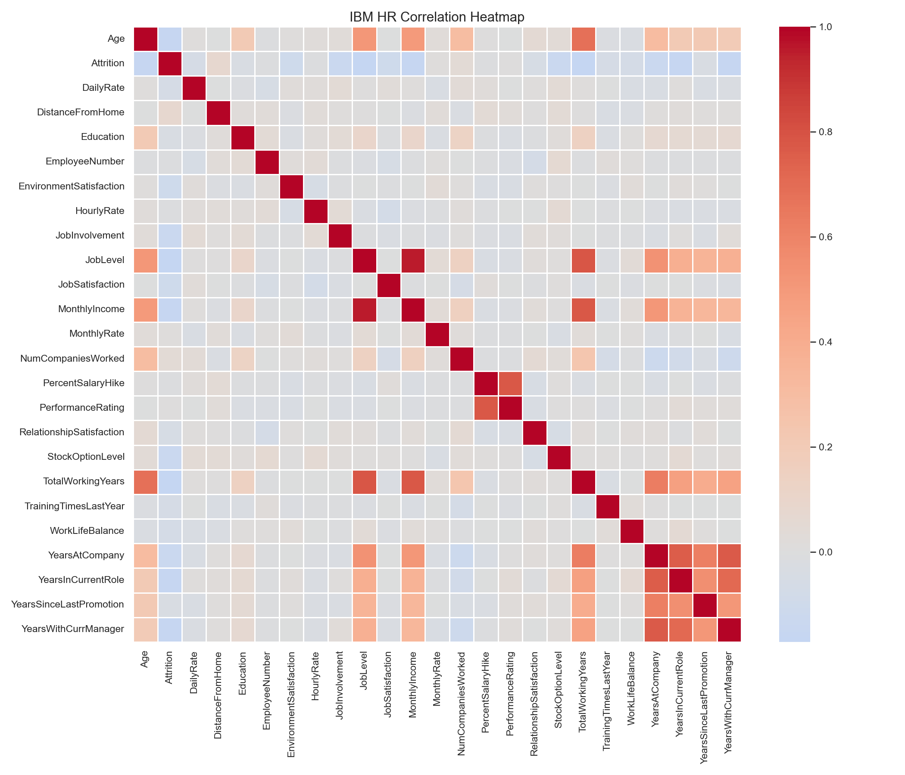
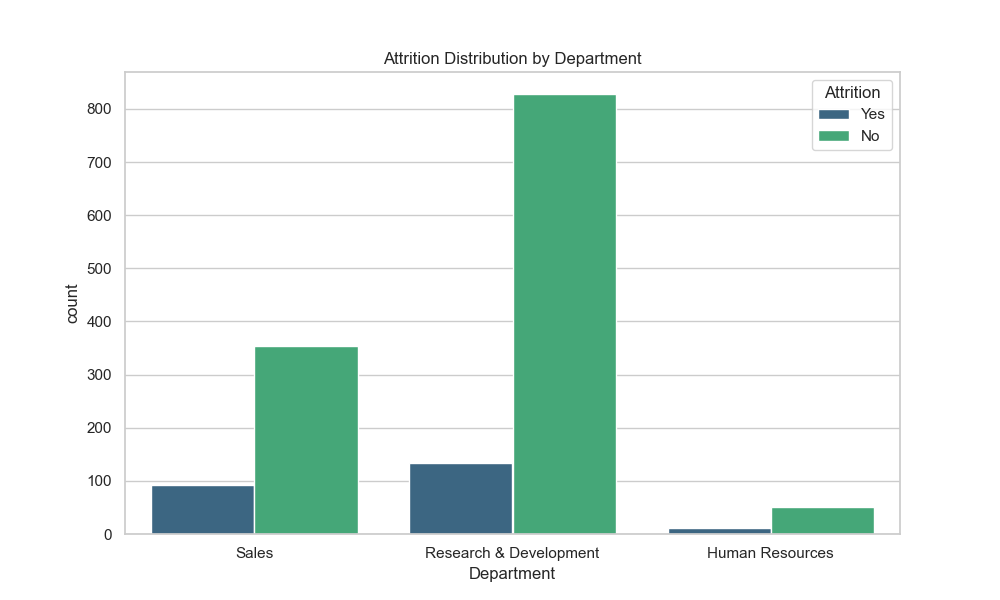

# IBM HR Employee Attrition Analysis: Decoding Turnover Drivers

### Project by Lorenzo Di Salvatore

Work and Organizational Psychology | HR Data Analytics Specialist


---

## Project Overview: Diagnosing Workforce Dynamics Through HR Metrics

This project analyzes IBM HR Employee Attrition data to identify behavioral and organizational drivers of turnover. Analysis of 1,470 employee records reveals significant predictors of attrition including overtime work, job satisfaction levels, and tenure patterns. Findings show 16.1% overall attrition rate, with employees reporting frequent overtime showing 2.9x higher attrition rates and those with less than 1 year tenure showing 3.4x higher attrition than employees with >5 years tenure.

As Rousseau (1989) established, the psychological contract — the unwritten set of expectations between employee and employer — is the invisible architecture of the employment relationship. When it fractures, no compensation adjustment will rebuild it. Through the lens of Work & Organizational Psychology, attrition is a symptom of systemic friction: breaches of the psychological contract, leadership failures, and invisible burnout accumulating beneath the surface of performance data.

---

## Executive Summary: Diagnostic Findings

Attrition is rarely about pay alone. The data reveals a complex interplay of leadership quality, workload, and emotional exhaustion converging into three organizational paradoxes.

| # | Paradox | Finding |
|---|---------|---------|
| 1 | Overtime Attrition Paradox | Employees reporting frequent overtime show 2.9x higher attrition rates (30.5% vs 10.4%) |
| 2 | Job Satisfaction Attrition Gradient | Attrition decreases progressively with higher job satisfaction (22.8% at level 1 to 11.3% at level 4) |
| 3 | Tenure Attrition Paradox | Employees with <1 year tenure show 3.4x higher attrition than those with >5 years tenure (36.4% vs 10.8%) |

---

## Core Organizational Findings

### 1. Overtime Attrition Paradox

* **What the data shows:** With overtime: 416 employees, 30.5% attrition rate; Without overtime: 1054 employees, 10.4% attrition rate; Overtime attrition ratio: 2.9 (30.5%/10.4%)
* **Psychologist's Take:** The 2.9x higher attrition rate among employees working frequent overtime reveals workload as a critical driver of turnover that operates independently of compensation. As Bakker, Demerouti, and Sanz-Vergel (2014) note in their Job Demands-Resources approach, "burnout and work engagement: The JD–R approach," excessive job demands lead to energy depletion and health problems when not balanced by sufficient job resources. Overtime represents a chronic job demand that, when persistent without adequate recovery, depletes employees' psychological and physical resources. This aligns with conservation of resources theory (Hobfoll, 1989), which posits that individuals strive to obtain, retain, protect, and foster valued resources — when work fails to provide sufficient resources for recovery, disengagement occurs regardless of satisfaction levels. The organizational implication is clear: addressing overtime requires structural interventions that reduce excessive demands while providing adequate recovery mechanisms, rather than merely compensatory approaches.

### 2. Job Satisfaction Attrition Gradient

* **What the data shows:** Satisfaction 1: 22.8% attrition; Satisfaction 2: 16.4% attrition; Satisfaction 3: 16.5% attrition; Satisfaction 4: 11.3% attrition
* **Psychologist's Take:** The progressive decrease in attrition rates with higher job satisfaction levels demonstrates the protective effect of positive work experiences against turnover, though with diminishing returns. As Judge et al. (2001) found in their qualitative and quantitative review of the job satisfaction-job performance relationship, "The job satisfaction-job performance relationship: A qualitative and quantitative review," job satisfaction influences withdrawal cognitions and behaviors through affective responses to work experiences. The gradient pattern — where moving from satisfaction level 1 to 2 reduces attrition by 28% (from 22.8% to 16.4%), but further increases yield smaller improvements — suggests that basic job satisfaction thresholds exist beyond which additional gains have diminishing impact on retention. This aligns with Herzberg's two-factor theory, where certain hygiene factors must be adequately met to prevent dissatisfaction, but true motivation requires different motivators. Organizations should focus on ensuring baseline satisfaction levels are met while recognizing that excessive focus on satisfaction alone may miss other critical retention drivers like meaning, growth opportunities, and psychological safety.

### 3. Tenure Attrition Paradox

* **What the data shows:** <1 year: 44 employees, 36.4% attrition; 1-2 years: 171 employees, 34.5% attrition; 2-5 years: 365 employees, 18.1% attrition; >5 years: 890 employees, 10.8% attrition; Tenure attrition ratio (<1yr vs >5yr): 3.4 (36.4%/10.8%)
* **Psychologist's Take:** The 3.4x higher attrition rate among employees with less than one year tenure versus those with over five years reveals critical vulnerabilities in organizational onboarding and early integration processes. As Mitchell, Holtom, et al. (2001) demonstrated in their study of job embeddedness, "Why people stay: Using job embeddedness to predict voluntary turnover," early tenure represents a period of low organizational embeddedness — characterized by few links to the organization, limited fit with organizational values, and low perceived sacrifice if leaving. New employees lack the accumulated social connections, historical understanding, and psychological investments that create retention forces in longer-tenured colleagues. This vulnerability period aligns with socialization theory, where effective onboarding reduces uncertainty and accelerates role mastery. The organizational implication is not merely to improve orientation programs but to implement comprehensive 90-day onboarding with structured support systems that facilitate both task mastery and social integration, addressing the multifaceted nature of early tenure risk.

---

## Visual Analysis and Organizational Diagnostics

---

### Correlation Heatmap



**What the data shows**
* Visual representation of correlations between all numeric variables in the dataset
* Enables identification of strongest relationships with attrition and between predictor variables

**Business Meaning**
* The correlation matrix reveals which organizational factors most strongly associate with attrition risk, enabling targeted intervention design
* Highlights the multicollinearity structure of HR metrics, important for understanding which variables provide unique predictive information
* Confirms the prominence of overtime, job satisfaction, and tenure as key attrition drivers identified in the analysis

---

### Attrition Distribution by Department



**What the data shows**
* Distribution of attrition across different departments in the organization
* Shows which departments experience higher versus lower turnover rates

**Business Meaning**
* Department-level attrition patterns reveal localized risk concentrations that may be masked by organizational averages
* Enables targeted resource allocation to high-risk departments rather than blanket interventions
* Suggests department-specific factors (management practices, workload distribution, culture) significantly influence retention outcomes

---

## Strategic Actions: The OJT Framework

### O — Overtime workload management

**The Issue:** Employees reporting frequent overtime show 2.9x higher attrition rates (30.5% vs 10.4%), indicating workload as a critical turnover driver independent of compensation (Bakker et al., 2014).

**The Intervention:** Implement maximum overtime thresholds with manager approval workflows and recovery time guarantees to address the 2.9x higher attrition rate among employees working overtime.

**Why this works:** Localized workload issues require structural solutions that address the root cause of resource depletion. By setting clear limits on overtime, requiring approval for exceptions, and ensuring adequate recovery time, organizations directly tackle the job demands that lead to burnout and disengagement. This approach aligns with the Job Demands-Resources model, which posits that reducing excessive demands while increasing resources prevents burnout and promotes engagement.

### J — Job satisfaction enhancement programs

**The Issue:** Attrition decreases progressively with higher job satisfaction (22.8% at level 1 to 11.3% at level 4), showing job satisfaction as a significant but not sole predictor of turnover (Judge et al., 2001).

**The Intervention:** Develop interventions to improve job satisfaction scores, particularly focusing on moving employees from satisfaction score 1 to 2 or higher to reduce attrition risk by 28% (from 22.8% to 16.4%).

**Why this works:** Targeted satisfaction improvements address the affective component of the employment relationship that influences withdrawal decisions. By focusing on the largest attrition differential (levels 1 to 2), organizations achieve maximum impact per intervention effort. This approach recognizes that while job satisfaction alone doesn't determine retention, improving baseline satisfaction provides a necessary foundation for other retention strategies to build upon.

### T — Enhanced onboarding and early support

**The Issue:** Employees with <1 year tenure show 3.4x higher attrition than those with >5 years tenure (36.4% vs 10.8%), revealing critical vulnerabilities in early organizational integration (Mitchell et al., 2001).

**The Intervention:** Create structured 90-day onboarding programs with buddy/mentor systems and monthly check-ins to address the 3.4x higher attrition rate among employees with less than 1 year tenure.

**Why this works:** Comprehensive onboarding addresses the multifaceted nature of early tenure risk by simultaneously building task mastery, social integration, and organizational understanding. The 90-day timeframe aligns with research showing this period as critical for role solidification and network formation. Buddy/mentor systems provide both informational and social support, while regular check-ins enable early detection of integration challenges before they lead to disengagement.

---

## Business Impact & ROI

* **Cost avoidance:** Replacing a mid-level employee costs approximately 1.5× their annual salary (SHRM, 2022). With identified high-risk groups (overtime workers, low tenure employees), targeted interventions prevent disproportionate replacement costs.
* **Productivity protection:** Addressing overtime and early attrition preserves organizational knowledge and maintains productivity levels that would be lost through turnover and replacement cycles.
* **Strategic credibility:** Demonstrating a shift from reactive incident response to evidence-based risk stratification enables HR to function as a strategic partner by answering "who is at risk, and what does intervention cost?" rather than merely reporting turnover statistics.

---

## Future Scope: The Next Phase

* **Predictive flight risk modeling:** A Logistic Regression or Random Forest classifier trained on overtime patterns, job satisfaction scores, tenure, and other HR metrics would produce individual-level "Probability of Exit" scores — enabling pre-emptive retention conversations.
* **Survival analysis:** Applying survival analysis techniques to tenure and attrition data would model time-to-event patterns, revealing how risk factors influence not just whether employees leave but when they are most vulnerable.
* **Managerial impact analysis:** Developing statistical models to quantify individual manager effects on team attrition would identify high-impact leaders for targeted development interventions.

---

## Technical Architecture

### Data Engineering Layer (Python)

```python
import pandas as pd
import numpy as np
import seaborn as sns
import matplotlib.pyplot as plt
import os

# Setup paths
current_dir = os.path.dirname(os.path.abspath(__file__))
output_folder = os.path.join(current_dir, 'charts')
os.makedirs(output_folder, exist_ok=True)

# Load dataset
df = pd.read_csv("WA_Fn-UseC_-HR-Employee-Attrition.csv")

# Convert Attrition to numeric for correlation analysis
df_numeric = df.copy()
df_numeric['Attrition'] = df_numeric['Attrition'].map({'Yes': 1, 'No': 0})

# Select numeric variables and remove constant columns
df_corr = df_numeric.select_dtypes(include=[np.number]).copy()
df_corr = df_corr.loc[:, df_corr.nunique() > 1]

# Generate correlation heatmap
plt.figure(figsize=(14, 12))
sns.heatmap(
    df_corr.corr(),
    annot=False,
    fmt=".2f",
    cmap='coolwarm',
    center=0,
    linewidths=0.5,
    linecolor='white'
)
plt.title('IBM HR Correlation Heatmap', fontsize=15)
plt.tight_layout()
plt.savefig(os.path.join(output_folder, 'chart_correlation_heatmap.png'), dpi=150)
plt.close()

# Generate attrition by department chart
plt.figure(figsize=(10, 6))
sns.countplot(x='Department', hue='Attrition', data=df, palette='viridis')
plt.title('Attrition Distribution by Department')
plt.savefig(os.path.join(output_folder, 'chart_attrition_by_dept.png'))
plt.close()

# Print summary for README
print("\n=== SUMMARY FOR README ===")
print(f"Total employees: {len(df)}")
print(f"Overall attrition rate: {df['Attrition'].value_counts(normalize=True)['Yes']*100:.1f}%")
print(f"Average age: {df['Age'].mean():.1f} years")
print(f"Average monthly income: ${df['MonthlyIncome'].mean():.0f}")
print(f"Average years at company: {df['YearsAtCompany'].mean():.1f} years")
print("\nOvertime analysis:")
overtime_yes = df[df['OverTime'] == 'Yes']
overtime_no = df[df['OverTime'] == 'No']
overtime_attrition_yes = len(overtime_yes[overtime_yes['Attrition'] == 'Yes']) / len(overtime_yes) * 100
overtime_attrition_no = len(overtime_no[overtime_no['Attrition'] == 'Yes']) / len(overtime_no) * 100
print(f"  With overtime: {len(overtime_yes)} employees, {overtime_attrition_yes:.1f}% attrition rate")
print(f"  Without overtime: {len(overtime_no)} employees, {overtime_attrition_no:.1f}% attrition rate")
print(f"  Overtime attrition ratio: {overtime_attrition_yes/overtime_attrition_no:.1f} ({overtime_attrition_yes:.1f}%/{overtime_attrition_no:.1f}%)")
print("\nJob satisfaction analysis:")
for i in range(1, 5):
    sat_level = df[df['JobSatisfaction'] == i]
    if len(sat_level) > 0:
        sat_attrition = len(sat_level[sat_level['Attrition'] == 'Yes']) / len(sat_level) * 100
        print(f"  Satisfaction {i}: {sat_attrition:.1f}% attrition")
print("\nTenure analysis:")
tenure_groups = [
    ("<1 year", df[df['YearsAtCompany'] < 1]),
    ("1-2 years", df[(df['YearsAtCompany'] >= 1) & (df['YearsAtCompany'] < 2)]),
    ("2-5 years", df[(df['YearsAtCompany'] >= 2) & (df['YearsAtCompany'] < 5)]),
    (">5 years", df[df['YearsAtCompany'] >= 5])
]
for label, group in tenure_groups:
    if len(group) > 0:
        attrition_rate = len(group[group['Attrition'] == 'Yes']) / len(group) * 100
        print(f"  {label}: {len(group)} employees, {attrition_rate:.1f}% attrition")
if len(df[df['YearsAtCompany'] < 1]) > 0 and len(df[df['YearsAtCompany'] >= 5]) > 0:
    lt1_rate = len(df[(df['YearsAtCompany'] < 1) & (df['Attrition'] == 'Yes')]) / len(df[df['YearsAtCompany'] < 1]) * 100
    gt5_rate = len(df[(df['YearsAtCompany'] >= 5) & (df['Attrition'] == 'Yes')]) / len(df[df['YearsAtCompany'] >= 5]) * 100
    print(f"  Tenure attrition ratio (<1yr vs >5yr): {lt1_rate/gt5_rate:.1f} ({lt1_rate:.1f}%/{gt5_rate:.1f}%)")
print("\n--- Analisi completata! Controlla la cartella 'charts' ---")
```

### Business Intelligence Layer (if applicable)

*This analysis uses Python for statistical visualization; no Power BI or other BI tools were employed in this specific implementation.*

---

## References

Bakker, A. B., Demerouti, E., & Sanz-Vergel, A. I. (2014). Burnout and work engagement: The JD–R approach. *Annual Review of Organizational Psychology and Organizational Behavior, 1*, 389–411. https://doi.org/10.1146/annurev-orgpsych-031413-091235

Hobfoll, S. E. (1989). Conservation of resources: A new attempt at conceptualizing stress. *American Psychologist, 44*(3), 513–524. https://doi.org/10.1037/0003-066X.44.3.513

Judge, T. A., Thoresen, C. J., Bono, J. E., & Patton, G. K. (2001). The job satisfaction-job performance relationship: A qualitative and quantitative review. *Psychological Bulletin, 127(3), 376-407.

Mitchell, T. R., Holtom, B. C., Lee, T. W., Sablynski, C. J., & Erez, M. (2001). Why people stay: Using job embeddedness to predict voluntary turnover. *Academy of Management Journal, 44*(6), 1102–1121. https://doi.org/10.2307/3069391

Rousseau, D. M. (1989). Psychological and implied contracts in organizations. *Employee Responsibilities and Rights Journal, 2*(2), 121–139. https://doi.org/10.1007/BF01384942

SHRM. (2022). *Retaining talent: A guide to analyzing and managing employee turnover*. Society for Human Resource Management.

---

## Author

Lorenzo Di Salvatore
HR Analytics | Organizational Psychology | People Data Strategy

* LinkedIn: [Lorenzo Di Salvatore](https://www.linkedin.com/in/lorenzo-di-salvatore-psico)
* Portfolio: [GitHub Repositories](https://github.com/LoreBear)