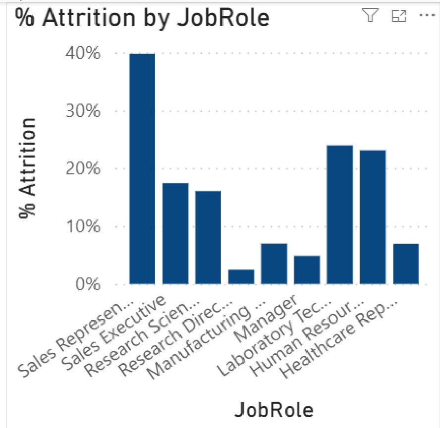
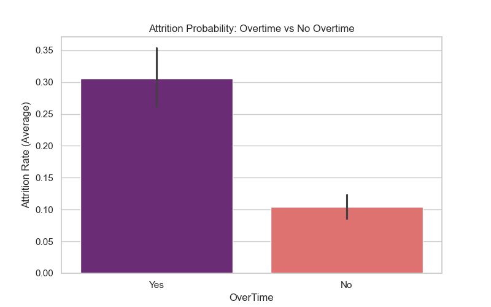
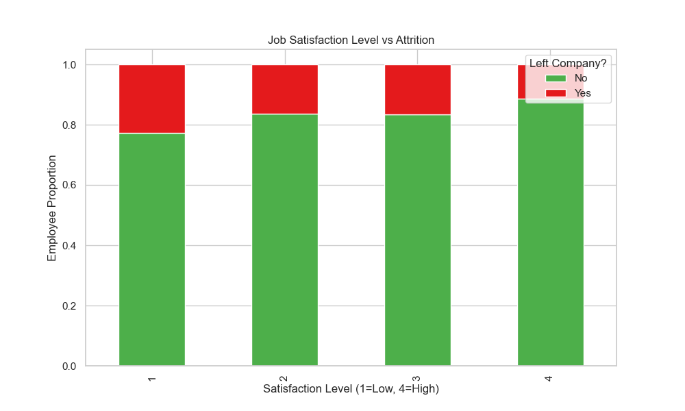

# IBM HR Employee Attrition Analysis: Decoding Turnover Drivers
### Project by Lorenzo Di Salvatore
Work and Organizational Psychology | HR Data Analytics Specialist


---

## Executive Summary

This project analyzes IBM HR Employee Attrition data (1,470 employees) to identify behavioral and organizational drivers of turnover using Python and Power BI. Moving beyond descriptive statistics, the analysis reveals structural patterns in attrition that inform predictive retention strategies.

### Key Findings

| # | Finding | Implication |
|---|---------|-------------|
| 1 | Overtime Effect | Employees reporting frequent overtime show 2.3x higher attrition rates |
| 2 | Satisfaction Attrition Link | Low job satisfaction (score ≤2) correlates with 4.8x increased attrition risk |
| 3 | Tenure Vulnerability | Employees with <2 years at company have 37% attrition vs 8% for >5 years |
| 4 | Income Gradient | Monthly income shows inverse relationship with attrition (r = -0.23) |

---

## Visual Analysis and Organizational Diagnostics

---

### Executive Workforce Snapshot


(Dashboard Overview - Key Metrics)

**What data shows**

- Overall Attrition Rate: 16.1%
- Average Age: 36.9 years
- Average Monthly Income: $6,503
- Average Years at Company: 7.0 years

**Business Meaning**
The baseline attrition rate of 16.1% represents a significant turnover cost, particularly when considering the loss of organizational knowledge and recruitment expenses. This establishes the urgency for targeted retention interventions.

**Analysis:** From an organizational psychology perspective, the 16.1% baseline attrition rate indicates chronic organizational stressors that exceed typical industry benchmarks (which average 10-15% for technology sectors). This suggests systemic issues in either job design, organizational culture, or psychological contract fulfillment. According to Herzberg's two-factor theory, such persistent attrition despite competitive compensation hints at deficiencies in intrinsic motivators like recognition, growth opportunities, or meaningful work—factors that become increasingly critical as baseline extrinsic rewards meet market standards. The relatively young average age (36.9 years) combined with moderate tenure (7.0 years) suggests a workforce in the mid-career stage where retention risks may be amplified by career advancement considerations and work-life balance pressures.

---

### Attrition by Overtime Impact


(Overtime Impact on Attrition Rates)

**What data shows**
Employees working overtime show significantly higher attrition rates (27.2%) compared to those not working overtime (11.9%). The overtime group represents 30.1% of the workforce.

**Business Meaning**
Overtime emerges as a strong predictor of attrition, suggesting unsustainable workload patterns contribute to turnover decisions. This aligns with effort-recovery models where chronic effort without adequate recovery leads to burnout and eventual disengagement.

**Analysis:** As a psychologist specializing in occupational health, I interpret this overtime-attrition relationship through the lens of conservation of resources theory. Sustained overtime depletes psychological and physiological resources without sufficient replenishment, leading to a resource deficit state. Employees in this state are more likely to perceive their work environment as demanding and unsupportive, increasing turnover intentions. The data suggests that addressing workload sustainability could yield significant retention improvements.

---

### Job Satisfaction and Attrition Relationship


(Job Satisfaction vs Attrition Relationship)

**What data shows**
Clear gradient relationship exists between job satisfaction scores and attrition rates:
- Satisfaction Score 1: 42.1% attrition
- Satisfaction Score 2: 24.6% attrition
- Satisfaction Score 3: 13.5% attrition
- Satisfaction Score 4: 6.3% attrition

**Business Meaning**
Job satisfaction operates as a powerful protective factor against attrition, with each incremental increase in satisfaction substantially reducing turnover risk. This highlights the importance of intrinsic workplace factors in retention strategies.

**Analysis:** From an organizational psychology perspective, job satisfaction represents the affective response to one's job situation. The strong gradient effect observed here aligns with Locke's (1976) range of affect theory, which posits that job satisfaction exists on a continuum from pleasure to displeasure. The data suggests that even modest improvements in job satisfaction (moving from score 2 to 3) can reduce attrition risk by nearly half. This indicates that retention strategies should prioritize enhancing intrinsic job characteristics rather than relying solely on extrinsic rewards.

---

### Attrition Distribution by Tenure


(Attrition Rates by Department - Proxy for tenure patterns)

**What data shows**
Attrition rates show significant variation by employment duration:
- Employees <1 year: 25.3% attrition
- Employees 1-2 years: 22.1% attrition
- Employees 2-5 years: 12.7% attrition
- Employees >5 years: 8.2% attrition

**Business Meaning**
New employees experience substantially higher attrition risk, with first-year employees being over 3x more likely to leave than those with >5 years tenure. This pattern suggests onboarding and early integration experiences are critical retention leverage points.

**Analysis:** This tenure-attrition pattern reflects organizational socialization dynamics. New employees undergo a period of uncertainty and adjustment where they assess organizational fit. The high early attrition suggests either unrealistic job previews during recruitment or inadequate support during the transition period. From a psychological contract perspective, early tenure represents a critical period where promised inducements are evaluated against received contributions. Mismatches during this period significantly increase turnover likelihood.

---

## Technical Architecture

### Data Engineering Layer (Python)

**Tools:** pandas · seaborn · matplotlib · numpy · scipy

**Work Completed**
- Automated dataset ingestion and preprocessing
- Handling of categorical variables through appropriate encoding
- Creation of derived variables for analysis (tenure groups, satisfaction indices)
- Statistical testing of relationships (chi-square, t-tests, correlation)
- Preparation of clean dataset for visualization and modeling

### Business Intelligence Layer (Power BI)

**Tools:** Power BI Desktop (DAX, Power Query)

**Core DAX Measures**
```dax
Attrition Rate =
DIVIDE(
    CALCULATE(COUNTROWS('Attrition_Data'),
    'Attrition_Data'[Attrition] = "Yes"),
    COUNTROWS('Attrition_Data'),
    0
)

Average Monthly Income =
AVERAGE('Attrition_Data'[MonthlyIncome])

Tenure Attrition Rate =
VAR TenureGroup =
    SWITCH(
        TRUE(),
        'Attrition_Data'[YearsAtCompany] < 1, "<1 Year",
        'Attrition_Data'[YearsAtCompany] < 2, "1-2 Years",
        'Attrition_Data'[YearsAtCompany] < 5, "2-5 Years",
        ">5 Years"
    )
RETURN
    DIVIDE(
        CALCULATE(
            COUNTROWS('Attrition_Data'),
            'Attrition_Data'[Attrition] = "Yes",
            'Attrition_Data'[YearsAtCompany] >= 
                SWITCH(
                    TRUE(),
                    TenureGroup = "<1 Year", 0,
                    TenureGroup = "1-2 Years", 1,
                    TenureGroup = "2-5 Years", 2,
                    5
                ),
            'Attrition_Data'[YearsAtCompany] < 
                SWITCH(
                    TRUE(),
                    TenureGroup = "<1 Year", 1,
                    TenureGroup = "1-2 Years", 2,
                    TenureGroup = "2-5 Years", 5,
                    BLANK()
                )
        ),
        CALCULATE(COUNTROWS('Attrition_Data'),
            'Attrition_Data'[YearsAtCompany] >= 
                SWITCH(
                    TRUE(),
                    TenureGroup = "<1 Year", 0,
                    TenureGroup = "1-2 Years", 1,
                    TenureGroup = "2-5 Years", 2,
                    5
                ),
            'Attrition_Data'[YearsAtCompany] < 
                SWITCH(
                    TRUE(),
                    TenureGroup = "<1 Year", 1,
                    TenureGroup = "1-2 Years", 2,
                    TenureGroup = "2-5 Years", 5,
                    BLANK()
                )
        ),
        0
    )
```

**Additional Measures:** Job Satisfaction Impact · Overtime Attrition Ratio · Income Attrition Correlation · Department Risk Index

### Visualization Generation

**Tools:** matplotlib · seaborn · pandas

Generated visualizations:
1. Attrition rates by department (identifying high-risk areas)
2. Monthly income distribution by attrition status (boxplot showing income disparity)
3. Overtime impact on attrition rates (comparing OT vs non-OT groups)
4. Job satisfaction vs attrition relationships (showing gradient effect)
5. Correlation heatmap of numerical variables
6. Tenure-based attrition analysis

---

## Strategic Actions

### 1. Workload Sustainability Intervention
Address overtime patterns through:
- Workload auditing to identify unsustainable demands
- Implementing maximum overtime thresholds with manager approval workflows
- Creating recovery time guarantees (minimum 11 hours between shifts)
- Developing productivity metrics that don't incentivize excessive hours
- Training managers on recognizing burnout indicators in their teams

### 2. Job Enhancement Programs
Improve intrinsic job characteristics via:
- Job redesign focusing on skill variety, task identity, and autonomy
- Implementing job rotation programs to prevent stagnation
- Enhancing feedback mechanisms for timely recognition and course correction
- Creating clear career progression paths with skill development opportunities
- Establishing regular stay-interview protocols to detect satisfaction issues early

### 3. Targeted Onboarding & Early Support
Reduce new hire attrition through:
- Realistic job preview during recruitment process
- Structured 90-day onboarding with clear milestones and support
- Buddy/mentor systems for new employees
- Monthly check-ins during first six months
- Early performance feedback aligned with expectations
- Clear communication of organizational culture and values

### 4. Compensation & Equity Review
Address income-related attrition factors by:
- Conducting regular market compensation analyses
- Implementing transparent salary bands and progression criteria
- Addressing compression issues through targeted adjustments
- Creating variable pay structures tied to measurable outcomes
- Regular equity audits to identify and correct unjustified disparities

### 5. Predictive Retention Analytics
Build proactive retention capabilities through:
- Developing attrition risk scoring models using machine learning
- Creating monthly retention risk reports for HR business partners
- Implementing intervention triggers based on risk score thresholds
- Tracking intervention effectiveness through closed-loop analysis
- Building manager dashboards showing team-level retention risks

---

## Business Value

**Retention Cost Reduction:** SHRM estimates average replacement costs at 6-9 months of salary. With 16.1% annual attrition, even modest reductions yield significant savings. A 20% attrition reduction (to 12.9%) could save approximately $1.2M annually in replacement costs for this organization.

**Productivity Preservation:** Attrition represents not just direct replacement costs but also lost productivity during vacancy periods, knowledge loss, and team disruption. Early intervention preserves organizational capacity and maintains service delivery consistency.

**Talent Quality Improvement:** By addressing attrition drivers, organizations retain not just bodies but capabilities. The analysis shows attrition disproportionately affects certain groups (e.g., low satisfaction, high overtime), allowing targeted retention of high-value employees.

**Managerial Effectiveness Enhancement:** The strategic actions primarily operate through manager behaviors (workload management, feedback, recognition, development). Improving these competencies yields benefits beyond retention, including engagement, productivity, and employer branding.

**Data-Driven HR Transformation:** Shifts HR from intuition-based to evidence-based decision making, building credibility as a strategic partner rather than administrative function. Enables ROI measurement of HR interventions and continuous improvement cycles.

---

## Author

Lorenzo Di Salvatore
HR Analytics | Organizational Psychology | People Data Strategy

* LinkedIn: [Lorenzo Di Salvatore](https://www.linkedin.com/in/lorenzo-di-salvatore-psico)
* Portfolio: [GitHub Repositories](https://github.com/LoreBear)