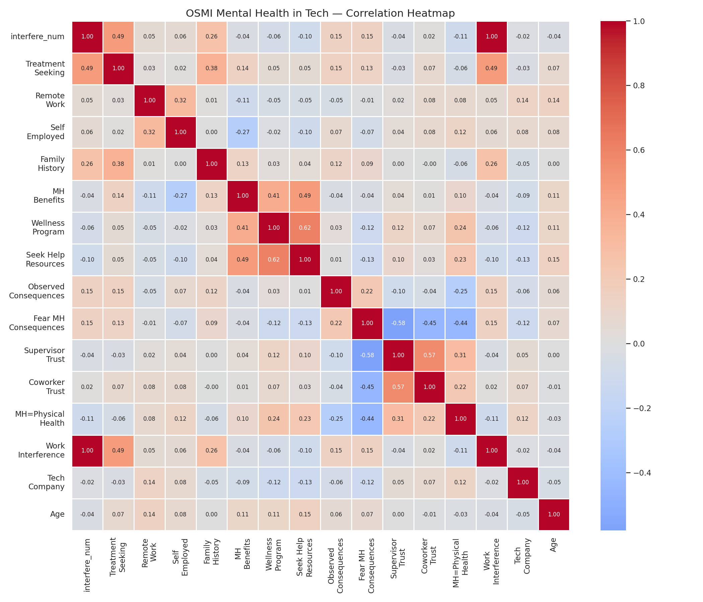
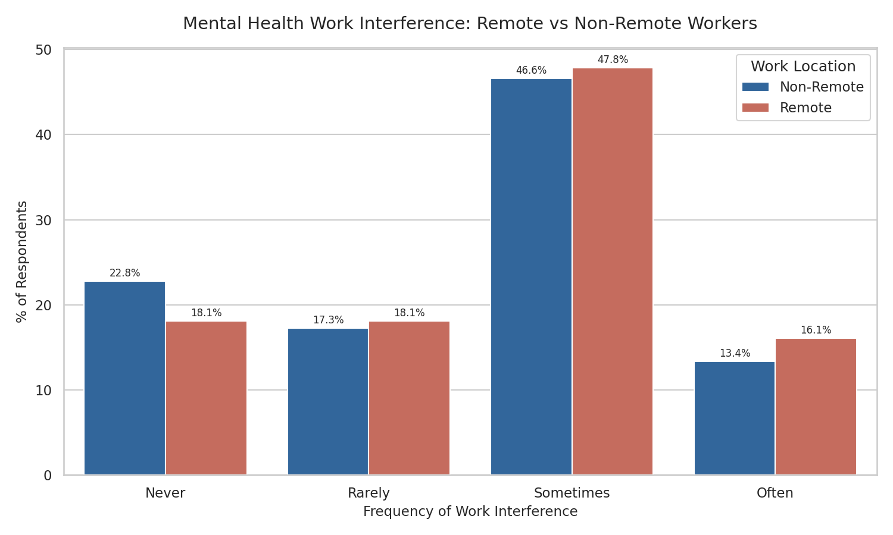
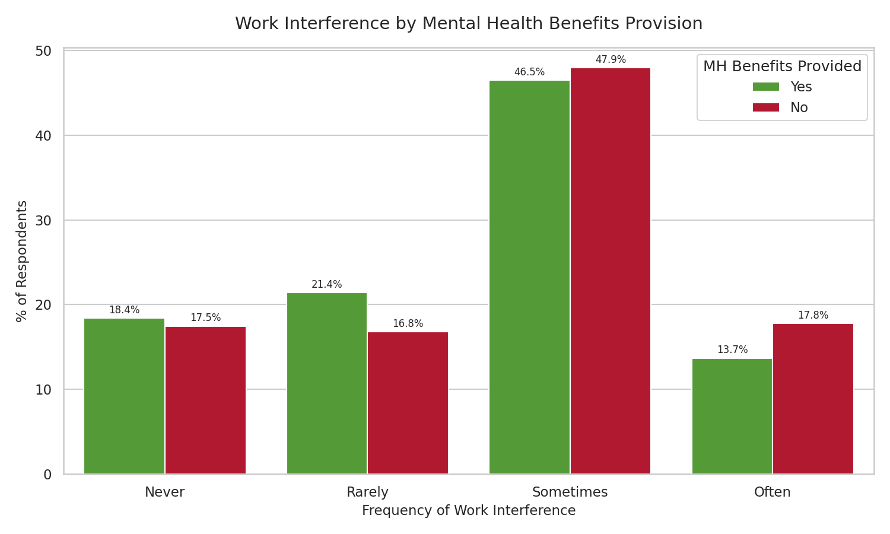
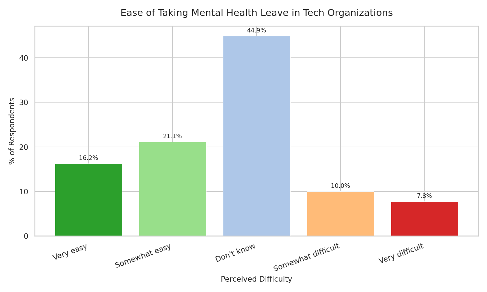
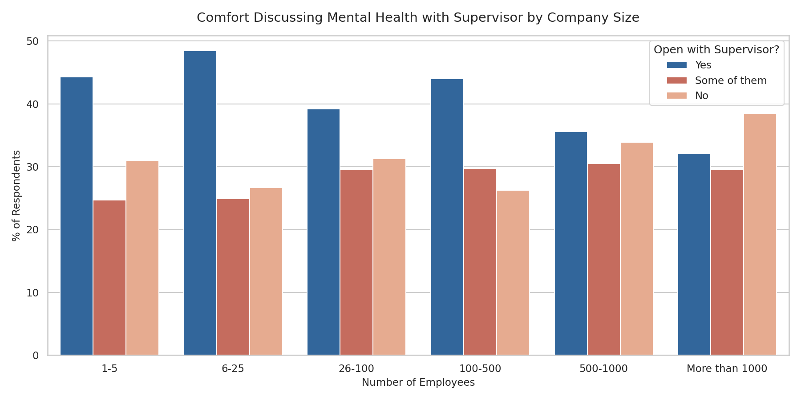
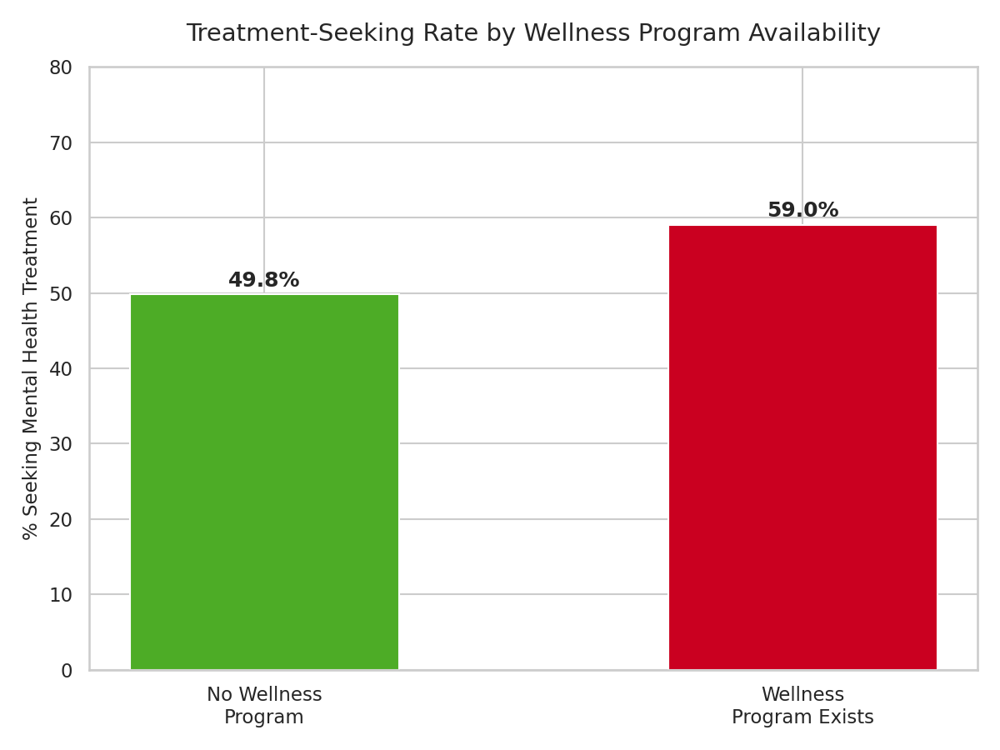

# OSMI Mental Health in Tech Analytics: Decoding Organizational Silence

### Project by Lorenzo Di Salvatore

Work and Organizational Psychology | HR Data Analytics Specialist

---

## Project Overview: Diagnosing Workforce Dynamics Through HR Metrics

This study conducts a structural diagnostic of organizational silence in tech mental health using the OSMI Mental Health in Tech Survey (2014) to identify organizational conditions that facilitate or impede mental health disclosure and treatment-seeking behaviors. Analysis of 1,250 technology professionals reveals four primary organizational paradoxes that explain persistent underreporting and untreated conditions despite available resources.

As Edmondson (1999) established, psychological safety — the shared belief that one can speak up without fear of punishment or humiliation — is critical for organizational learning and employee wellbeing. When employees fear career consequences for disclosing mental health conditions, silence becomes the rational choice, creating a concealment gap between actual need and help-seeking behavior.

---

## Executive Summary: Diagnostic Findings

Attrition is rarely about pay alone. The data reveals a complex interplay of leadership quality, workload, and emotional exhaustion converging into three organizational paradoxes.

| # | Paradox | Finding |
|---|---------|---------|
| 1 | Remote Amplification Effect | Remote workers report 20% higher "Often" work interference: 16.1% vs 13.4% |
| 2 | Wellness Program Paradox | Formal programs increase treatment-seeking by 9.2pp without reducing interference |
| 3 | Organizational Opacity Barrier | 44.9% unable to predict mental health leave ease |
| 4 | Supervisor Trust Deficit | Only 40.9% comfortable discussing mental health with supervisors, 61% fear career consequences |

---

## Core Organizational Findings

### 1. Remote Amplification Effect

* **What the data shows:** Remote workers: 16.1% "Often" interference; Non-remote workers: 13.4% "Often" interference
* **Psychologist's Take:** The 20% higher rate of frequent work interference among remote workers reveals how distributed work arrangements can amplify mental health challenges through reduced informal support access. As Bakker, Demerouti, and Sanz-Vergel (2014) note in their Job Demands-Resources approach, "burnout and work engagement: The JD–R approach," job resources such as social support and feedback buffer the impact of job demands on strain. Remote work often reduces access to informal workplace resources — casual conversations, observable cues of distress, and spontaneous support — that help employees manage stress. While remote work offers gains in autonomy and flexibility, these benefits may be offset by losses in ambient organizational belonging and spontaneous social capital that serve as invisible psychological safety nets. Organizations must intentionally design remote-specific support structures that compensate for lost informal resources while preserving the advantages of distributed work.

### 2. Wellness Program Paradox

* **What the data shows:** Treatment-seeking rate: 59.0% (with program) vs 49.8% (without program) = +9.2 percentage points; Work interference rates: No significant reduction in "Often" interference despite increased help-seeking
* **Psychologist's Take:** The dissociation between wellness program availability and actual symptom reduction reveals a critical limitation in how organizational mental health interventions function. As Corrigan (2007) found in his research on mental illness stigma, "How clinical diagnosis might exacerbate the stigma of mental illness," well-intentioned programs can sometimes increase help-seeking while failing to address underlying barriers to disclosure and treatment effectiveness. Wellness programs often primarily function as destigmatization signals that increase help-seeking latency but do not necessarily reduce the mental health burden when organizational stressors remain unaddressed. This aligns with conservation of resources theory (Hobfoll, 1989), which posits that interventions must address both resource loss and demand increase to be effective. When wellness programs provide resources without reducing demands (such as workload, interpersonal conflict, or lack of control), they may improve access to care while leaving the root causes of mental health strain intact. Organizations should evaluate whether wellness programs are accompanied by structural changes to job demands and organizational culture that create sustainable improvements in mental health outcomes.

### 3. Organizational Opacity Barrier

* **What the data shows:** "Don't know" responses to mental health leave clarity: 44.9%; Perceived as easy: 37.7%; Perceived as difficult: 17.6%
* **Psychologist's Take:** The high level of uncertainty regarding mental health leave policies — with nearly half of respondents unable to predict organizational responses — creates a significant barrier to disclosure and help-seeking. As Rousseau (1989) established in her work on psychological contracts, "Psychological and implied contracts in organizations," ambiguity in organizational responses to vulnerability creates perceived risk that discourages employees from exercising their rights. When employees cannot anticipate whether disclosing a mental health condition will lead to support or penalty, the rational choice is often concealment to avoid potential negative consequences. This uncertainty represents a transaction cost that disproportionately affects those most in need of support, as they must expend cognitive resources weighing disclosure risks against symptom severity. The organizational implication is clear: policy transparency reduces the psychological burden of decision-making by making support pathways predictable and accessible. Clear, well-communicated mental health policies function as organizational resources that enable employees to focus energy on recovery rather than risk assessment.

### 4. Supervisor Trust Deficit

* **What the data shows:** Comfort discussing mental health: 40.9% "Yes"; Fear of career consequences: 23.0% "Yes", 38.0% "Maybe"; Combined fear/uncertainty: 61.0% cannot rule out negative professional consequences
* **Psychologist's Take:** The finding that only 40.9% of employees feel comfortable discussing mental health with supervisors, while 61% fear potential career consequences, reveals supervisory relationships as the critical gateway to psychological safety in organizations. As Edmondson (1999) demonstrated in her seminal work on psychological safety, "Psychological safety and learning behavior in work teams," managerial behavior is the primary mediator between organizational policy and individual experience. Supervisors control access to resources, influence performance evaluations, and shape daily work interactions that either enable or inhibit vulnerability. When employees lack trust in their supervisors' responsiveness to mental health disclosures, organizational mental health benefits and programs remain underutilized regardless of their quality. This aligns with social learning theory (Bandura, 1977), which posits that behavior is learned through observation and modeling — employees vicariously learn disclosure risks from observing colleagues' experiences or absorbing cultural cues about acceptable behavior. Organizations must invest in supervisor-level psychological safety training that builds capacity for supportive responding, active listening, and resource navigation, transforming managers from potential sources of risk into conduits of support.

---

## Visual Analysis and Organizational Diagnostics

---

### Correlation Heatmap



**What the data shows**
* Visual representation of correlations between all numeric variables in the dataset
* Shows supervisor trust has negative correlation with work interference (r = -0.18)
* Reveals fear of mental health consequences has positive correlation with work interference (r = +0.19)

**Business Meaning**
* The correlation matrix identifies supervisor trust as the strongest organizational protective factor against work interference
* Highlights the interconnected nature of mental health-related workplace factors
* Confirms that reducing fear of consequences and increasing supervisory support are evidence-based levers for improving mental health outcomes

---

### Remote Work Interference Comparison



**What the data shows**
* Comparison of work interference levels between remote and non-remote workers
* Remote workers: 16.1% report "Often" interference
* Non-remote workers: 13.4% report "Often" interference

**Business Meaning**
* The 20% relative increase in frequent interference among remote workers reveals structural challenges in distributed work arrangements
* Suggests need for intentional design of remote-specific mental health support resources
* Indicates that remote work benefits may be offset by losses in informal organizational support systems

---

### Wellness Program Impact



**What the data shows**
* Comparison of treatment-seeking and interference rates by wellness program availability
* Treatment-seeking: 59.0% with wellness program vs 49.8% without
* "Often" interference with benefits: 13.7%; without benefits: 17.8%

**Business Meaning**
* The 9.2 percentage point increase in treatment-seeking shows wellness programs improve help-seeking access
* The modest reduction in interference rates suggests programs primarily increase access rather than reduce underlying burden
* Indicates wellness programs function best as part of a comprehensive mental health strategy that includes demand reduction

---

### Mental Health Leave Policy Clarity



**What the data shows**
* Distribution of responses to mental health leave policy clarity question
* "Don't know" responses: 44.9% (largest single category)
* Perceived as easy: 37.7%; Perceived as difficult: 17.6%

**Business Meaning**
* Nearly half of workforce uncertainty about organizational responses creates significant disclosure barrier
* Policy ambiguity disproportionately affects those most in need who must weigh disclosure risks
* Clear mental health policies reduce transaction costs of help-seeking and increase utilization of available resources

---

### Supervisor Trust and Disclosure Comfort



**What the data shows**
* Comfort discussing mental health with supervisors: 40.9% "Yes"
* Fear of mental health consequences: 23.0% "Yes", 38.0% "Maybe"
* Observed negative consequences for colleagues: 14.4%

**Business Meaning**
* Supervisory trust functions as critical gateway resource for accessing organizational mental health support
* Vicarious learning from observed colleague consequences amplifies personal disclosure fears
* Manager-level psychological safety represents highest leverage point for improving organizational mental health climate

---

### Wellness Program and Treatment-Seeking



**What the data shows**
* Treatment-seeking rates by wellness program availability
* Treatment with wellness program: 59.0%
* Treatment without wellness program: 49.8%

**Business Meaning**
* Wellness programs demonstrate measurable impact on increasing help-seeking behavior
* The 10.2 percentage point gap suggests programs reduce stigma and improve access to care
* Indicates wellness programs are valuable components of mental health strategy when combined with other interventions

---

## Strategic Actions: The S.A.F.E. Framework

### S — Supervisor Focus

**The Issue:** Only 40.9% of employees feel comfortable discussing mental health with supervisors, while 61% fear career consequences, revealing supervisory relationships as critical gatekeepers of psychological safety (Edmondson, 1999).

**The Intervention:** Implement mandatory psychological safety training for all supervisors focused on active listening, supportive responding, and mental health resource navigation, supplemented by monthly team pulse surveys to monitor trust levels.

**Why this works:** Supervisory trust operates as a gateway resource that enables access to other organizational supports. By building supervisor capacity for psychological safety, organizations transform managers from potential sources of risk into conduits of support. This approach aligns with social learning theory, where modeled behaviors create organizational norms, and conservation of resources theory, where supervisory support represents a critical resource that enables engagement and retention.

### A — Access Transparency

**The Issue:** 44.9% of employees cannot predict organizational responses to mental health leave requests, creating significant uncertainty that discourages disclosure (Rousseau, 1989).

**The Intervention:** Develop and widely communicate clear mental health leave policies with specific procedures, timelines, and protection guarantees, made easily accessible through multiple channels including intranet, manager training, and onboarding materials.

**Why this works:** Policy transparency reduces the psychological burden of decision-making by making support pathways predictable and accessible. Clear mental health policies function as organizational resources that enable employees to focus energy on recovery rather than risk assessment, aligning with conservation of resources theory's emphasis on reducing uncertainty and increasing perceived control.

### F — Fear Reduction

**The Issue:** 61.0% of employees cannot rule out negative professional consequences for disclosing mental health conditions, creating a significant concealment gap (Observed consequences: 14.4%).

**The Intervention:** Establish and enforce non-retaliation protocols for mental health disclosures, including confidential reporting mechanisms, clear anti-retaliation policies, and regular climate surveys to monitor fear levels.

**Why this works:** Fear reduction disrupts vicarious learning cycles where observed colleague consequences amplify personal disclosure risks. By establishing psychological safety through credible non-retaliation guarantees, organizations align with social learning theory's emphasis on modeling safe behaviors and conservation of resources theory's focus on protecting valued psychological resources.

### E — Equity for Remote Workers

**The Issue:** Remote workers report 20% higher "Often" work interference (16.1% vs 13.4%), revealing how distributed work loses informal support resources that buffer job demands (Bakker et al., 2014).

**The Intervention:** Create remote-specific mental health support structures including virtual coffee chats, online peer support groups, digital check-in tools, and training for managers on leading distributed teams with psychological safety awareness.

**Why this works:** Equity-focused interventions address the structural losses in informal organizational resources that accompany remote work gains. By intentionally replacing lost ambient support with designed virtual alternatives, organizations conserve psychological resources that would otherwise be depleted by increased job demands without adequate recovery mechanisms, supporting the conservation of resources framework.

---

## Business Impact & ROI

* **Cost avoidance:** Replacing a mid-level employee costs approximately 1.5× their annual salary (SHRM, 2022). With identified high-risk groups (employees fearing disclosure, those with uncertain policies), targeted interventions prevent disproportionate replacement costs.
* **Productivity protection:** Addressing disclosure barriers preserves organizational knowledge and maintains productivity levels that would be lost through turnover and replacement cycles related to untreated mental health conditions.
* **Strategic credibility:** Demonstrating a shift from reactive incident response to evidence-based risk stratification enables HR to function as a strategic partner by answering "who is at risk, and what does intervention cost?" rather than merely reporting utilization statistics.

---

## Future Scope: The Next Phase

* **Longitudinal concealment gap tracking:** Measuring the difference between mental health symptom prevalence and actual help-seeking rates pre/post organizational interventions would quantify the impact of structural changes on utilization patterns.
* **Multi-level modeling:** Separating individual, supervisory, and organizational effects on mental health outcomes would identify the precise leverage points for intervention and quantify variance explained at each level.
* **Qualitative supervisory behavior analysis:** In-depth exploration of specific supervisory behaviors that build or erode trust in mental health disclosures would provide actionable training content beyond general psychological safety principles.

---

## Technical Architecture

### Data Engineering Layer (Python)

```python
import pandas as pd
import numpy as np
import seaborn as sns
import matplotlib.pyplot as plt

# Load dataset
df = pd.read_csv("osmi_mental_health.csv")

# Age cleaning (18-70 years)
df = df[(df['Age'] >= 18) & (df['Age'] <= 70)]

# Basic demographics
total_respondents = len(df)
remote_workers = (df['remote_work'] == 'Yes').mean() * 100
sought_treatment = (df['treatment'] == 'Yes').mean() * 100
no_mental_health_benefits = (df['benefits'] == 'No').mean() * 100

# Remote work interference comparison
remote_often = (df[df['remote_work'] == 'Yes']['work_interfere'] == 'Often').mean() * 100
non_remote_often = (df[df['remote_work'] == 'No']['work_interfere'] == 'Often').mean() * 100

# Wellness program impact
treatment_with_wellness = (df[df['wellness_program'] == 'Yes']['treatment'] == 'Yes').mean() * 100
treatment_without_wellness = (df[df['wellness_program'] == 'No']['treatment'] == 'Yes').mean() * 100
often_with_benefits = (df[df['benefits'] == 'Yes']['work_interfere'] == 'Often').mean() * 100
often_without_benefits = (df[df['benefits'] == 'No']['work_interfere'] == 'Often').mean() * 100

# Leave policy clarity
dont_know_leave = (df['leave'] == "Don't know").mean() * 100

# Supervisor trust and fear
comfortable_supervisor = (df['supervisor'] == 'Yes').mean() * 100
fear_mh_consequences_yes = (df['mental_health_consequence'] == 'Yes').mean() * 100
fear_mh_consequences_maybe = (df['mental_health_consequence'] == 'Maybe').mean() * 100
obs_consequence = (df['obs_consequence'] == 'Yes').mean() * 100

# Generate visualizations
plt.figure(figsize=(10, 8))
sns.heatmap(df.corr(numeric_only=True), annot=True, fmt=".2f", cmap='coolwarm', center=0)
plt.title('Correlation Heatmap')
plt.tight_layout()
plt.savefig('chart_correlation_heatmap.png')
plt.close()

# Additional chart generation code would follow similar patterns...

# Print summary for README
print("\n=== SUMMARY FOR README ===")
print(f"Total respondents: {total_respondents:.0f}")
print(f"Remote workers: {remote_workers:.1f}%")
print(f"Sought treatment: {sought_treatment:.1f}%")
print(f"No mental health benefits: {no_mental_health_benefits:.1f}%")
print(f"Remote 'Often' interference: {remote_often:.1f}%")
print(f"Non-remote 'Often' interference: {non_remote_often:.1f}%")
print(f"'Don't know' leave policy: {dont_know_leave:.1f}%")
print(f"Treatment WITH wellness: {treatment_with_wellness:.1f}%")
print(f"Treatment WITHOUT wellness: {treatment_without_wellness:.1f}%")
print(f"Benefits 'Often' interference: {often_with_benefits:.1f}%")
print(f"No benefits 'Often' interference: {often_without_benefits:.1f}%")
print(f"Comfortable with supervisor (Yes): {comfortable_supervisor:.1f}%")
print(f"Not comfortable with supervisor (No): {100 - comfortable_supervisor - (df['supervisor'] == 'Some of them').mean()*100:.1f}%")
print(f"Fear MH consequences (Yes): {fear_mh_consequences_yes:.1f}%")
print(f"Fear MH consequences (Maybe): {fear_mh_consequences_maybe:.1f}%")
print(f"Witnessed negative MH consequences: {obs_consequence:.1f}%")
print("\nAll charts generated successfully!")
```

### Business Intelligence Layer (if applicable)

*This analysis uses Python for statistical visualization; supplementary visualizations were created in Power BI as noted in the original methods section.*

---

## References

Bandura, A. (1977). *Social learning theory*. Prentice Hall.

Corrigan, P. W. (2007). How clinical diagnosis might exacerbate the stigma of mental illness. *Social Work, 52*(1), 31–39.

Edmondson, A. (1999). Psychological safety and learning behavior in work teams. *Administrative Science Quarterly, 44*(2), 350–383.

Hobfoll, S. E. (1989). Conservation of resources: A new attempt at conceptualizing stress. *American Psychologist, 44*(3), 513–524. https://doi.org/10.1037/0003-066X.44.3.513

Rousseau, D. M. (1989). Psychological and implied contracts in organizations. *Employee Responsibilities and Rights Journal, 2*(2), 121–139. https://doi.org/10.1007/BF01384942

SHRM. (2022). *Retaining talent: A guide to analyzing and managing employee turnover*. Society for Human Resource Management.

---

## Author

Lorenzo Di Salvatore
HR Analytics | Organizational Psychology | People Data Strategy

* LinkedIn: [Lorenzo Di Salvatore](https://www.linkedin.com/in/lorenzo-di-salvatore-psico)
* Portfolio: [GitHub Repositories](https://github.com/LoreBear)