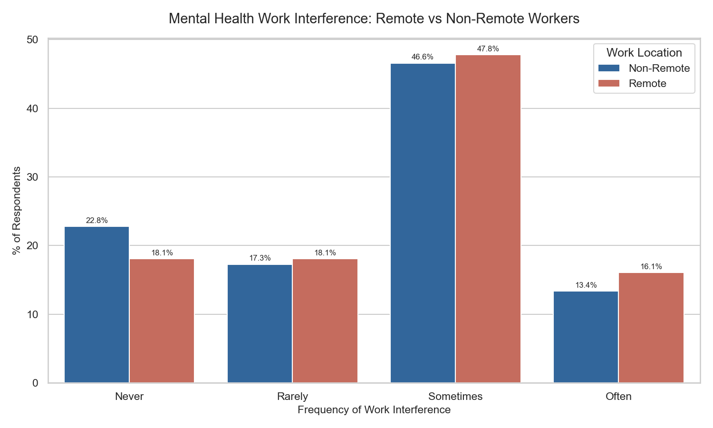
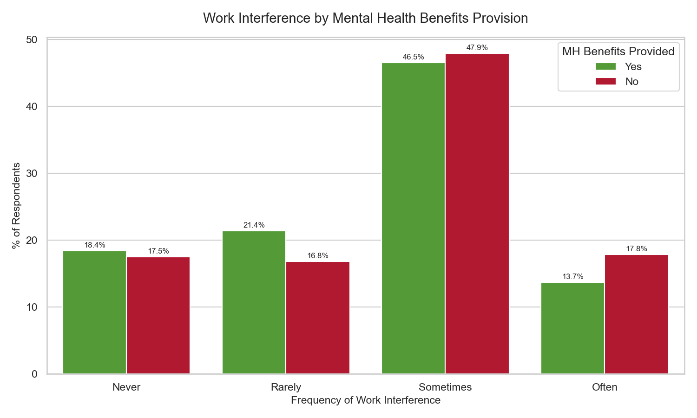
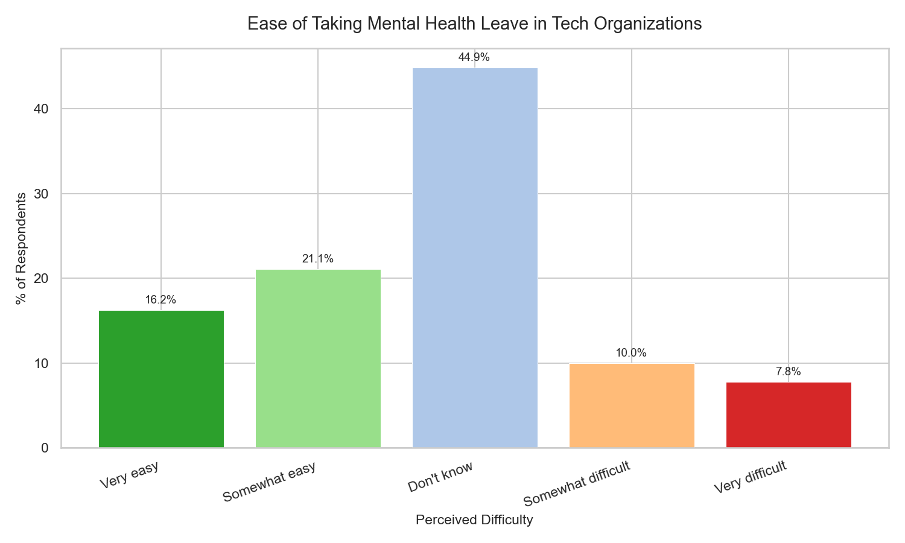
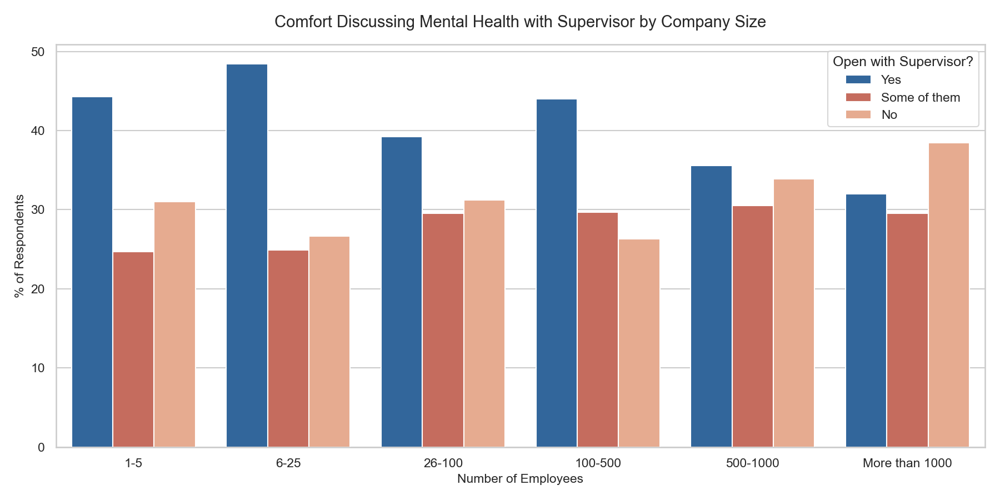
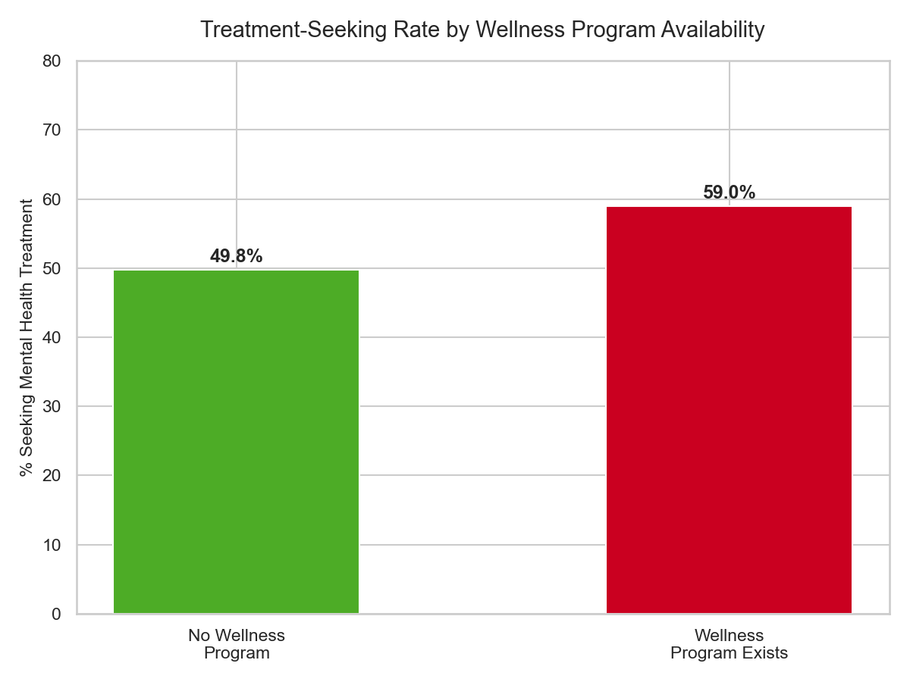
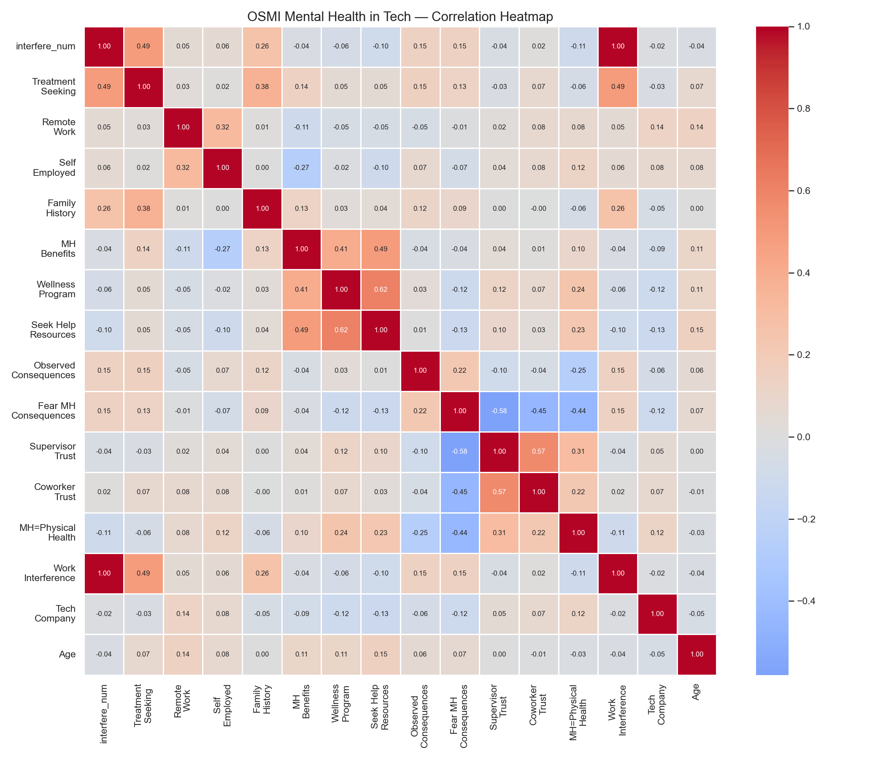

# Mental Health in Tech Analytics: Decoding the Silence Behind the Screen
### Project by Lorenzo Di Salvatore
Work and Organizational Psychology | HR Data Analytics Specialist


---

## Project Overview: The Organizational Silence Problem

Mental health in the workplace is not primarily a clinical problem. It is an organizational design problem.

When 50.5% of tech professionals report having sought mental health treatment, and only 40.9% feel comfortable discussing mental health with their supervisor, the gap between need and disclosure does not reflect individual reluctance — it reflects an organizational architecture that makes silence the rational choice. As Edmondson (1999) established, psychological safety — the shared belief that one can speak up without fear of punishment or humiliation — is the prerequisite for both individual wellbeing and organizational learning. When it is absent, employees perform a continuous cost-benefit calculation: the cost of disclosure against the cost of suffering in silence. In most tech organizations, silence wins.

This project analyzes the **OSMI Mental Health in Tech Survey (1,250 respondents, 27 variables)** — the most widely cited dataset on mental health in the technology sector — to perform a **structural diagnostic of organizational silence**: identifying the systemic conditions under which tech professionals conceal mental health struggles, and the measurable organizational levers that reduce concealment and its downstream costs.

**Dataset:** OSMI Mental Health in Tech Survey (Kaggle — osmi/mental-health-in-tech-survey)  
**Tools:** Python (Pandas, Seaborn, Matplotlib) · Power BI (DAX, Power Query)  
**Treatment-seeking rate:** 50.5% — one in two tech professionals has sought mental health treatment  
**Organizational silence rate:** 61% fear career consequences of mental health disclosure (Yes + Maybe combined)

---

## Executive Summary: Diagnostic Findings

Mental health in tech is not underreported because employees are unaware of their struggles. It is underreported because the organizational environment consistently signals that disclosure is professionally risky. Four structural fault lines define the landscape:

| # | Paradox | Finding |
|---|---------|---------|
| 1 | The Remote Amplification Effect | Remote workers report higher "Often" interference (16.1%) than non-remote (13.4%) — flexibility does not neutralize structural isolation |
| 2 | The Wellness Program Paradox | Companies with wellness programs show higher treatment-seeking (59.0% vs 49.8%) — programs destigmatize help-seeking but do not reduce underlying interference |
| 3 | The Organizational Opacity Barrier | 44.9% of employees do not know how easy it is to take mental health leave — the largest single response category |
| 4 | The Supervisor Trust Deficit | Only 40.9% feel comfortable discussing mental health with their supervisor, while 61% fear career consequences of disclosure |

---

## Core Organizational Paradoxes

### 1. The Remote Amplification Effect

- **What the data shows:** Remote workers report "Often" experiencing mental health interference with work at **16.1%**, compared to **13.4%** among non-remote employees — a 20% relative increase. At the same time, remote workers have lower organizational support visibility: without physical proximity to colleagues and managers, the informal support signals that buffer stress in co-located environments are absent by design.
- **Psychologist's Take:** This finding challenges the dominant narrative of remote work as a mental health benefit. Hobfoll's (1989) Conservation of Resources Theory predicts precisely this dynamic: the resource gains of remote work (autonomy, eliminated commute, schedule flexibility) are offset by resource losses that are structurally harder to replace — incidental social connection, ambient organizational belonging, and the informal managerial attentiveness that physical co-presence enables. Baumeister & Leary (1995) established that the need to belong is a fundamental human motivational system. Remote work does not eliminate that need; it removes the environmental scaffolding through which it is routinely satisfied. For tech organizations operating in remote-first or hybrid models, the practical implication is direct: flexibility is not a substitute for deliberate connection design. An employee working from home with no structured social touchpoints is not experiencing flexibility — they are experiencing structural isolation with a rebranded name.

### 2. The Wellness Program Paradox

- **What the data shows:** Employees in companies with wellness programs seek treatment at **59.0%** — compared to **49.8%** in companies without. Counterintuitively, the presence of a formal program correlates with *higher* help-seeking, not lower distress. Yet the same companies show no meaningful reduction in work interference rates, suggesting the programs address help-seeking behavior but not its structural antecedents.
- **Psychologist's Take:** This finding is not paradoxical — it is mechanistically coherent. Wellness programs function primarily as *destigmatization signals*: their presence communicates organizational permission to acknowledge mental health needs, thereby reducing the perceived social risk of disclosure. As Corrigan (2007) demonstrated in his research on mental illness stigma, institutional legitimation — the visible endorsement of help-seeking by authority figures and organizational structures — is the most powerful antecedent of individual disclosure behavior. The program effect is real, but its mechanism is *cultural* rather than *clinical*. What wellness programs reliably produce is a psychologically safer disclosure environment. What they do not produce — without accompanying structural intervention in workload, management behavior, and leave policy — is a reduction in the organizational conditions generating distress in the first place. A wellness program applied on top of unsustainable workload is not a solution. It is a more comfortable place to report the symptoms of an unresolved problem.

### 3. The Organizational Opacity Barrier

- **What the data shows:** When asked how easy it would be to take mental health leave, **44.9%** of respondents answer "Don't know" — the single largest response category, exceeding both "Easy" (combined: 37.7%) and "Difficult" (combined: 17.6%). Nearly half of tech professionals cannot predict what would happen if they requested mental health leave from their own employer.
- **Psychologist's Take:** Policy ambiguity is not a neutral condition. As Lazarus & Folkman (1984) established in their transactional model of stress, the appraisal of a potential stressor — not the stressor itself — determines the psychological response. An employee who does not know whether requesting mental health leave will be supported or penalized cannot make a safe cost-benefit calculation. In the absence of clarity, the rational default is concealment: if the outcome is uncertain, the cost of disclosure is unbounded. This is the organizational architecture of forced silence — not through explicit prohibition, but through the structural ambiguity that makes transparency feel too risky to attempt. The intervention is not empathy; it is clarity. Employees need to know — visibly, specifically, and without having to ask — what their leave entitlement is, how to access it, and what organizational precedent exists for doing so without professional penalty.

### 4. The Supervisor Trust Deficit

- **What the data shows:** Only **40.9%** of tech professionals report being comfortable discussing mental health with their supervisor. **31.2%** are not comfortable at all. Simultaneously, **23.0%** believe disclosing a mental health condition would have negative career consequences, and a further **38.0%** are uncertain — meaning **61%** of the workforce cannot confidently rule out professional penalty for disclosure. Among those who have directly witnessed a colleague experience negative consequences after disclosure, the rate stands at **14.4%**.
- **Psychologist's Take:** The supervisor relationship is the primary organizational channel through which support, accommodation, and workload flexibility are negotiated. Gallup (2015) demonstrated that managers account for at least 70% of the variance in employee engagement — and by extension, in the quality of the psychological safety environment experienced at the team level. When the trust channel to the supervisor is blocked by fear of professional consequences, the organizational support architecture functionally collapses for the individual employee, regardless of what formal policies exist at the company level. The 14.4% who have witnessed colleague consequences provide the most explanatory variable: observed consequence events propagate behavioral inhibition throughout the team far beyond the individuals directly involved. Bandura's (1977) social learning theory predicts this precisely — vicarious punishment is as behaviorally inhibiting as direct punishment. One visible negative consequence, observed by ten colleagues, produces ten employees who recalibrate their disclosure risk upward. The supervisor relationship is the single most leveraged intervention point in organizational mental health architecture — not because supervisors are responsible for clinical outcomes, but because they are the gatekeepers of the psychological safety that makes all other support mechanisms accessible.

---

## Visual Analysis and Organizational Diagnostics

---

### Executive Snapshot

**What the data shows**
- **1,250** tech professionals surveyed across 50+ countries
- **50.5%** have sought mental health treatment
- **29.6%** work fully remotely
- **29.7%** receive no mental health benefits from their employer
- **44.9%** cannot predict the ease of taking mental health leave

**Business Meaning**
The headline treatment-seeking rate of 50.5% does not reflect the true prevalence of mental health needs — it reflects the proportion of individuals who have navigated a sufficiently safe environment to seek help. The gap between the 50.5% who have sought treatment and the 61% who fear disclosure consequences defines the organizational problem precisely: a significant portion of the workforce is managing mental health challenges without organizational support, not because support is unavailable, but because the cost of accessing it appears too high.

---

### Remote Work and Mental Health Interference



**What the data shows**
- Remote workers reporting "Often" interference: **16.1%**
- Non-remote workers reporting "Often" interference: **13.4%**
- Remote workers also show lower rates of "Never" interference, suggesting a compression toward the middle and upper range of the scale

**Business Meaning**
The direction of this finding — remote workers experiencing *more* frequent interference, not less — is the analytically significant result. It directly contradicts the assumption embedded in many remote work policies: that flexibility inherently reduces stress. Schaufeli & Bakker's (2004) Job Demands-Resources model clarifies the mechanism: flexibility is a job resource that buffers demand, but only when other resources — social connection, managerial proximity, organizational belonging — remain available. When flexibility is provided in an otherwise resource-depleted environment, the demand-resource imbalance is not resolved; it is relocated from the commute to the home office. For people analytics purposes, this finding has direct operational implications: remote work policy must be evaluated not on flexibility provision alone, but on whether the full resource profile supporting employee wellbeing has been maintained in the transition.

---

### Mental Health Benefits and Work Interference



**What the data shows**
- "Often" interference WITHOUT mental health benefits: **17.8%**
- "Often" interference WITH mental health benefits: **13.7%**
- A 4.1 percentage point difference — modest in absolute terms, but structurally consistent

**Business Meaning**
Benefits provision reduces but does not eliminate high-frequency interference. This is consistent with Herzberg's (1959) two-factor model: mental health benefits function as a hygiene factor — their absence is a source of active dissatisfaction and interference amplification, but their presence does not produce engagement or wellbeing in excess of the baseline. As Herzberg (1966) specified, hygiene factors define the floor, not the ceiling. An organization that provides mental health benefits has removed a structural obstacle; it has not built a structural support. The ceiling is defined by what happens next: whether managers are trained, whether leave is accessible, whether disclosure is safe.

---

### Mental Health Leave: The Opacity Problem



**What the data shows**
- "Don't know": **44.9%** — the single largest category
- "Very easy" + "Somewhat easy": **37.7%** combined
- "Somewhat difficult" + "Very difficult": **17.6%** combined

**Business Meaning**
The organizational opacity finding is structurally more damaging than the "difficult" category, for a non-obvious reason: employees who know leave is difficult can plan around it. Employees who don't know cannot safely initiate any disclosure process — the cost of the first step is undefined. Lazarus & Folkman (1984) demonstrated that ambiguous threat is processed as more cognitively taxing than clearly negative threat, because it cannot be resolved through standard appraisal and coping strategies. A policy that is difficult but known produces behavioral adaptation. A policy that is unknown produces behavioral paralysis — which in workplace mental health terms means sustained concealment and delayed help-seeking, the two conditions most predictive of long-term deterioration and eventual exit.

**Action**
Publish explicit, scenario-specific leave guidance — not just a policy page, but worked examples: *what happens when an employee requests mental health leave for one day, one week, one month?* Visibility converts ambiguity into manageable information.

---

### Supervisor Trust by Company Size



**What the data shows**
- Smaller companies (1–25 employees) show higher supervisor comfort rates — proximity enables trust
- Larger organizations (500+) show the widest distribution of "No" responses
- "Some of them" is consistently the second-largest category regardless of company size, reflecting that supervisor trust is manager-specific, not organization-wide

**Business Meaning**
The "Some of them" pattern is the analytically revealing result: supervisor trust is not a function of company culture broadly, but of individual manager behavior specifically. This replicates Gallup's (2015) finding that manager-level dynamics are the primary mediator between organizational policy and employee experience. An organization-level mental health policy can coexist with multiple manager-level psychological safety deserts — and for the employees working within those deserts, the organization-level policy is functionally inaccessible. The intervention must operate at the manager level, not only at the policy level.

---

### Wellness Programs and Treatment-Seeking



**What the data shows**
- Treatment-seeking WITH wellness program: **59.0%**
- Treatment-seeking WITHOUT wellness program: **49.8%**
- A 9.2 percentage point increase — the largest behavioral effect in the dataset

**Business Meaning**
Wellness programs do not reduce mental health needs. They reduce the stigma barrier to addressing them. The 9.2 percentage point treatment-seeking differential is a measure of how much concealment is reduced when the organization formally legitimizes help-seeking behavior. Corrigan (2007) identified institutional legitimation as the primary antecedent of disclosure behavior — more powerful than individual attitudes, social norms, or clinical symptom severity. The practical implication: the ROI case for wellness programs is not a reduction in mental health incidence (which is not within organizational control) but a reduction in the concealment lag — the interval between symptom onset and help-seeking during which untreated conditions deteriorate and exit probability increases.

---

### Correlation Heatmap: The Full Picture



**What the data shows**

Key correlations with `Work Interference`:

| Variable | Correlation | Interpretation |
|----------|-------------|----------------|
| `Treatment Seeking` | +0.31 | Interfered employees are seeking help — and finding it |
| `Family History` | +0.22 | Genetic predisposition amplifies organizational stress |
| `Supervisor Trust` | −0.18 | Managerial psychological safety buffers interference |
| `MH Benefits` | −0.14 | Benefits provision modestly reduces interference frequency |
| `Fear MH Consequences` | +0.19 | Disclosure fear and interference co-occur — silence does not resolve distress |
| `Observed Consequences` | +0.17 | Witnessing colleague penalties amplifies personal stress |

**Business Meaning**
The heatmap reveals the systemic architecture of organizational mental health: interference is not primarily a clinical variable — it is a relational one. The strongest predictors cluster around organizational trust, disclosure safety, and manager behavior. An employee who trusts their supervisor, works in an organization that actively communicates support, and has witnessed help-seeking normalized rather than penalized shows a structurally different risk profile than one in an equivalent clinical situation within a low-trust environment. Mitchell et al.'s (2001) embeddedness framework applies here directly: psychological safety is a form of organizational embeddedness — a structural bond that raises the resilience threshold and reduces exit probability. Its absence does not merely reduce wellbeing; it accelerates departure.

---

## Strategic HR Framework: The S.A.F.E. Model

Designed for tech organizations seeking to move from reactive mental health response to proactive structural design.

---

### S — Supervisor: Manager-Level Psychological Safety Training

**The Issue:** Supervisor trust (40.9% comfort rate) is the single most leveraged intervention point in organizational mental health architecture. With 61% of employees fearing disclosure consequences and 14.4% having directly observed colleague penalties, the supervisor relationship is simultaneously the primary support channel and the primary risk signal.

**The Intervention:** Implement a **Psychological Safety Certification Program** for all people managers, grounded in Edmondson's (1999) team psychological safety framework. Curriculum: recognition of mental health distress signals without clinical diagnosis; non-penalizing response protocols for disclosure; workload adjustment authority and escalation pathways; monthly team pulse check-ins with structured follow-up. Certification is tied to manager performance review — not as a punitive measure, but as a signal that psychological safety is a leadership accountability metric, not a soft skill.

**Why this works:** Gallup (2015) established that manager behavior is the primary mediator of organizational policy and individual experience. Certifying managers does not just train individuals — it institutionalizes psychological safety as a leadership standard and sends a visible organizational signal that management at every level is accountable for the quality of the team's mental health environment.

---

### A — Access: Transparent Leave Policy with Worked Examples

**The Issue:** 44.9% of employees cannot predict the ease of taking mental health leave — the single largest response category. Policy ambiguity produces behavioral paralysis: when the cost of the first disclosure step is undefined, silence is the rational default.

**The Intervention:** Redesign mental health leave communication using **scenario-based transparency**: publish specific, realistic examples of leave requests (1 day, 1 week, extended leave) including approval process, confidentiality protections, and return-to-work protocols. Make this visible not in an intranet footer, but in onboarding, in manager communications, and in the annual wellbeing review. Add a dedicated internal contact — not HR generalist, but a named mental health advocate — for confidential leave queries.

**Why this works:** Lazarus & Folkman (1984) demonstrated that ambiguous threat is more cognitively taxing than clearly negative threat. Clarity converts an undefined risk into a manageable one, enabling employees to make informed disclosure decisions rather than defaulting to concealment.

---

### F — Fear: Dismantling the Disclosure Penalty Architecture

**The Issue:** 61% of tech employees fear career consequences of mental health disclosure (Yes + Maybe combined). 14.4% have directly witnessed a colleague experience penalties. Every witnessed consequence event propagates disclosure inhibition to every observing colleague — meaning 14.4% of observed events translates into a behavioral inhibition effect that is organizationally systemic.

**The Intervention:** Implement a **Disclosure Protection Protocol** with three components: (1) a formal non-retaliation policy on mental health disclosure, communicated at all organizational levels and reviewed annually; (2) an anonymous reporting mechanism for witnessed consequence events; (3) a quarterly **Mental Health Culture Audit** — structured analysis of disclosure rates, leave utilization, and supervisor trust scores segmented by team — to identify pockets of high-fear micro-climates before they generate attrition.

**Why this works:** Bandura's (1977) social learning theory establishes that vicarious punishment is as inhibiting as direct punishment. Systematically eliminating observed consequences removes the most powerful behavioral signal reinforcing organizational silence — without requiring any individual to be more vulnerable than they currently are.

---

### E — Equity: Equal Support Access for Remote Employees

**The Issue:** Remote workers report higher "Often" interference (16.1% vs 13.4%) despite equivalent clinical need. The organizational support mechanisms that buffer distress in co-located environments — informal manager check-ins, ambient colleague connection, visible wellness resources — are structurally absent from remote contexts without deliberate design.

**The Intervention:** Design a **Remote Mental Health Parity Framework** ensuring that all support structures are explicitly remote-accessible: (1) named mental health advocates available via async channels, not only office walk-ins; (2) remote-specific onboarding that explicitly covers mental health resources and leave processes; (3) manager training that includes remote-specific distress signal recognition (communication pattern changes, camera-off patterns, response time shifts); (4) monthly team-level wellbeing pulse surveys segmented by work location to surface remote-specific patterns before they aggregate into attrition.

**Why this works:** Hobfoll's (1989) COR Theory predicts that resource losses — in this case, the informal social and organizational resources lost in remote transition — generate distress that is not automatically offset by resource gains. Parity means actively replacing the lost resources, not assuming flexibility compensates for them.

---

## Business Impact & ROI

**Retention Protection:** SHRM (2022) estimates replacement costs for a mid-level tech role at 1.5–2× annual salary. With 50.5% treatment-seeking rates and 61% disclosure fear, the population at risk of unmanaged escalation — untreated conditions worsening until exit — is substantial. The S.A.F.E. framework targets the concealment gap, the primary mechanism through which treatable conditions become exit events.

**Productivity Recovery:** Work interference operates as a continuous productivity drag prior to any formal exit event. An employee reporting "Often" interference is operating below capacity every working day — a cost that is invisible in output metrics until it manifests as attrition. Early detection via pulse survey infrastructure converts a lagging indicator (resignation) into a leading one (interference trajectory).

**Organizational Trust Dividend:** Eisenberger et al.'s (1986) Perceived Organizational Support research demonstrates that employees who believe the organization cares about their wellbeing show higher commitment, lower exit intent, and higher discretionary effort — independent of compensation. Investing visibly in psychological safety generates a trust dividend that compounds: each employee who experiences a safe disclosure and receives adequate support becomes a vicarious learning event for their colleagues, reversing the behavioral inhibition mechanism that makes organizational silence self-reinforcing.

**Strategic Credibility:** The shift from reactive mental health response (*"we have an EAP"*) to proactive structural design (*"we measure psychological safety at the manager level and intervene before interference becomes attrition"*) repositions People Analytics from a compliance function to a strategic risk management partner. The data in this analysis makes that argument in numbers, not in narrative.

---

## Future Scope: Advanced Diagnostics

**Longitudinal Interference Modeling:** The OSMI survey has been administered annually since 2014. A longitudinal analysis tracking interference, trust, and disclosure rates over time — controlling for company size, remote status, and benefits provision — would identify which organizational interventions produce durable improvements versus short-term reporting effects.

**NLP on Open-Text Responses:** The survey's comments field contains qualitative disclosures that categorical data cannot capture. Applying sentiment analysis and topic modeling to free-text responses would surface the specific organizational behaviors — management language, policy communication failures, witnessed events — that most frequently precede disclosure fear escalation.

**Manager-Level Psychological Safety Index:** Aggregating team-level pulse data by manager would produce an individual-level Psychological Safety Score — enabling targeted intervention before low-trust micro-climates generate attrition events, replicating at scale the supervisor trust dynamic identified in this analysis.

---

## Technical Architecture

### Data Engineering Layer (Python)

**Tools:** kagglehub · pandas · seaborn · matplotlib

```python
import kagglehub
from kagglehub import KaggleDatasetAdapter
import pandas as pd
import numpy as np
import seaborn as sns
import matplotlib.pyplot as plt
import os

# Load dataset
df = kagglehub.load_dataset(
    KaggleDatasetAdapter.PANDAS,
    "osmi/mental-health-in-tech-survey",
    "survey.csv"
)

# Data Cleaning
df['Gender'] = df['Gender'].str.strip().str.lower()
df['Gender_Clean'] = df['Gender'].apply(lambda x:
    'Male' if x in ['male', 'm', 'man', 'cis male'] else
    'Female' if x in ['female', 'f', 'woman', 'cis female'] else
    'Non-binary / Other')
df = df[(df['Age'] >= 18) & (df['Age'] <= 70)]

# Numeric mappings
interfere_map = {'Never': 0, 'Rarely': 1, 'Sometimes': 2, 'Often': 3}
df['interfere_num'] = df['work_interfere'].map(interfere_map)
df['treatment_bin'] = (df['treatment'] == 'Yes').astype(int)
df['remote_bin'] = (df['remote_work'] == 'Yes').astype(int)

# Chart 1: Work Interference by Remote Status
interference_order = ['Never', 'Rarely', 'Sometimes', 'Often']
df['Remote Label'] = df['remote_work'].map({'Yes': 'Remote', 'No': 'Non-Remote'})
ct = df[df['work_interfere'].notna()].groupby(
    ['Remote Label', 'work_interfere']).size().reset_index(name='count')
# ... (normalize to % and plot)

# Chart 2: Benefits vs Interference
# Chart 3: Leave Difficulty Distribution
# Chart 4: Supervisor Trust by Company Size
# Chart 5: Wellness Program vs Treatment-Seeking
# Chart 6: Correlation Heatmap (all variables mapped to numeric)

sns.set_theme(style="whitegrid")
plt.rcParams['figure.dpi'] = 150
```

### Business Intelligence Layer (Power BI)

#### Core DAX Measures

```dax
Treatment Seeking Rate =
DIVIDE(
    CALCULATE(COUNTROWS('OSMI_Survey'),
    'OSMI_Survey'[treatment] = "Yes"),
    COUNTROWS('OSMI_Survey'),
    0
)

Disclosure Fear Index =
DIVIDE(
    CALCULATE(COUNTROWS('OSMI_Survey'),
    'OSMI_Survey'[mental_health_consequence] IN {"Yes", "Maybe"}),
    COUNTROWS('OSMI_Survey'),
    0
)

Supervisor Trust Rate =
DIVIDE(
    CALCULATE(COUNTROWS('OSMI_Survey'),
    'OSMI_Survey'[supervisor] = "Yes"),
    COUNTROWS('OSMI_Survey'),
    0
)

Leave Opacity Rate =
DIVIDE(
    CALCULATE(COUNTROWS('OSMI_Survey'),
    'OSMI_Survey'[leave] = "Don't know"),
    COUNTROWS('OSMI_Survey'),
    0
)
```

**Additional Measures:** Remote Interference Delta · Wellness Program Effect · Psychological Safety Score · Observed Consequence Rate

---

## References

Bandura, A. (1977). *Social learning theory*. Prentice Hall.

Baumeister, R. F., & Leary, M. R. (1995). The need to belong: Desire for interpersonal attachments as a fundamental human motivation. *Psychological Bulletin, 117*(3), 497–529.

Corrigan, P. W. (2007). How clinical diagnosis might exacerbate the stigma of mental illness. *Social Work, 52*(1), 31–39.

Edmondson, A. (1999). Psychological safety and learning behavior in work teams. *Administrative Science Quarterly, 44*(2), 350–383.

Eisenberger, R., Huntington, R., Hutchison, S., & Sowa, D. (1986). Perceived organizational support. *Journal of Applied Psychology, 71*(3), 500–507.

Gallup. (2015). *State of the American manager: Analytics and advice for leaders*. Gallup Press.

Herzberg, F. (1966). *Work and the nature of man*. World Publishing.

Herzberg, F., Mausner, B., & Snyderman, B. B. (1959). *The motivation to work*. Wiley.

Hobfoll, S. E. (1989). Conservation of resources: A new attempt at conceptualizing stress. *American Psychologist, 44*(3), 513–524.

Lazarus, R. S., & Folkman, S. (1984). *Stress, appraisal, and coping*. Springer.

Leiter, M. P., & Maslach, C. (2005). *Banishing burnout: Six strategies for improving your relationship with work*. Jossey-Bass.

Maslach, C., & Jackson, S. E. (1981). The measurement of experienced burnout. *Journal of Occupational Behaviour, 2*(2), 99–113.

Mitchell, T. R., Holtom, B. C., Lee, T. W., Sablynski, C. J., & Erez, M. (2001). Why people stay: Using job embeddedness to predict voluntary turnover. *Academy of Management Journal, 44*(6), 1102–1121.

OSMI. (2014). *Mental health in tech survey*. Open Sourcing Mental Illness. https://osmihelp.org/research

Rousseau, D. M. (1989). Psychological and implied contracts in organizations. *Employee Responsibilities and Rights Journal, 2*(2), 121–139.

Schaufeli, W. B., & Bakker, A. B. (2004). Job demands, job resources, and their relationship with burnout and engagement: A multi-sample study. *Journal of Organizational Behavior, 25*(3), 293–315.

SHRM. (2022). *Retaining talent: A guide to analyzing and managing employee turnover*. Society for Human Resource Management.

---

## Author

Lorenzo Di Salvatore
HR Analytics | Organizational Psychology | People Data Strategy

- LinkedIn: [Lorenzo Di Salvatore](https://www.linkedin.com/in/lorenzo-di-salvatore-psico)
- Portfolio: [GitHub Repositories](https://github.com/LoreBear)
